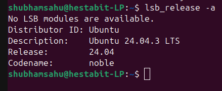
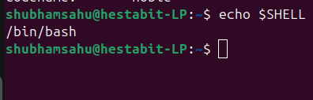
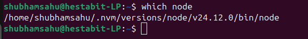
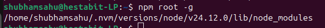
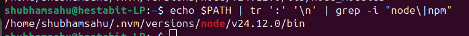
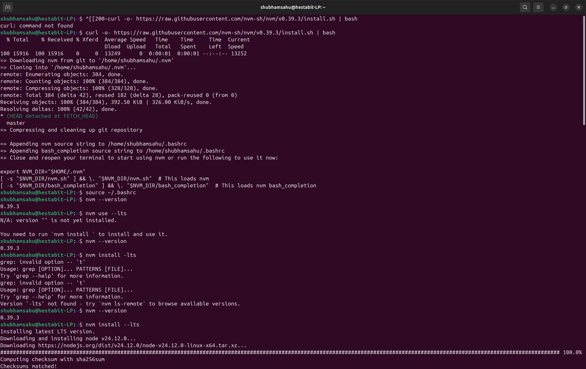
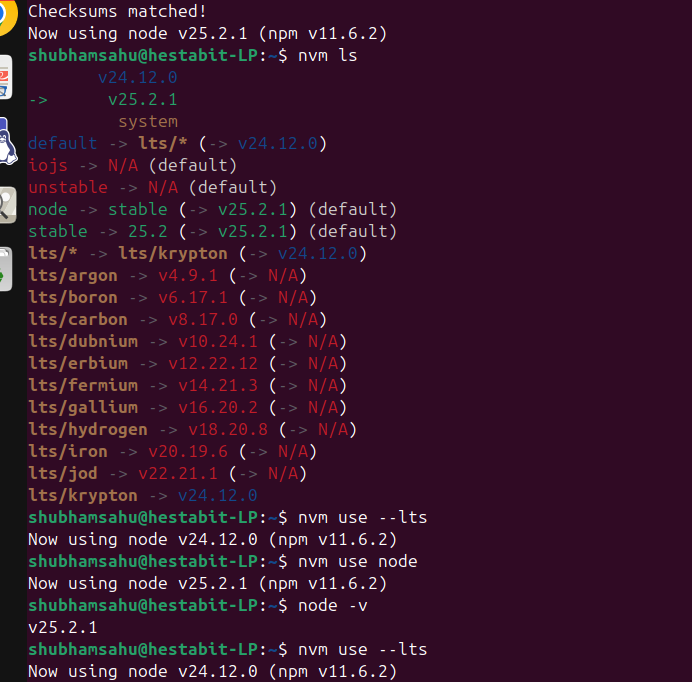
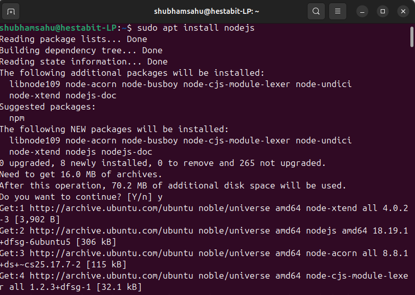
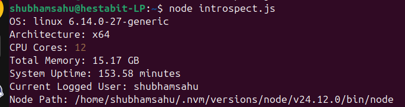
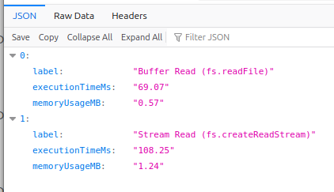

# SHubham Sahu
# DAY 1 — SYSTEM REVERSE ENGINEERING + NODE & TERMINAL MASTERING

## 📁 Project Folder Structure

```text
DAY1-System-Report/
├── system_report.md
├── introspect.js
├── streamBenchmark.js
├── bufferBenchmark.js
├── logs/
│   └── day1-perf.json
└── Images/
    ├── OS_version.png
    ├── Current_Shell.png
    ├── which_node.png
    ├── npm_path.png
    ├── all_path.png
    ├── nvm_install.png
    ├── npm_install.png
    ├── node_install.png
    ├── lts_front_back.png
    ├── output_introspectjs.png
    └── json_outcome.png
```

---

## 🔹 Task 1: System Identification

### 1. OS Version
Identifies the Linux distribution name, release, and version installed on the system.
**Command:**

```bash
lsb_release -a
```

**Output:**


---

### 2. Current Shell
Displays the default shell being used by the currently logged-in user.

**Command:**

```bash
echo $SHELL
```

**Output:**


---

### 3. Node Binary Path

Shows the absolute filesystem path where the Node.js executable is located.

**Command:**

```bash
which node
```

**Output:**


---

### 4. NPM Global Installation Path
Reveals the directory where globally installed npm packages are stored.

**Command:**

```bash
npm root -g
```

**Output:**


---

### 5. PATH Entries Containing Node or NPM
Filters the PATH environment variable to show entries related to Node.js or npm.

**Command:**

```bash
echo $PATH | tr ':' '
' | grep -Ei 'node|npm'
```

**Output:**


---

## 🔹 Task 2: NVM (Node Version Manager)

### 1. Install NVM
Installs Node Version Manager to manage and switch between multiple Node.js versions.

**Command:**

```bash
curl -o- https://raw.githubusercontent.com/nvm-sh/nvm/v0.39.7/install.sh | bash
```

Reload shell:

```bash
source ~/.bashrc
```

**Output:**


---

### 2. Switch Node Versions (LTS ↔ Latest)

Install LTS:

```bash
nvm install --lts
```

Install Latest:

```bash
nvm install node
```

Switch Versions:

```bash
nvm use --lts
nvm use node
```

**Output:**




---

### 2. Switch Node Versions (LTS ↔ Latest)
Demonstrates installing and switching between LTS and latest Node.js versions using NVM.

Install LTS:

```bash
nvm install --lts
```

Install Latest:

```bash
nvm install node
```

Switch Versions:

```bash
nvm use --lts
nvm use node
```

**Output:**


---

## 🔹 Task 3: System Introspection Script

### introspect.js
Collects and displays system-level information using Node.js core OS module.

Run: 
'''bash
nano introspect.js
'''
Run:

```bash
node introspect.js
```

**Output:**


---

## 🔹 Task 4: STREAM vs BUFFER Benchmark

### 1. Create Large Test File (50MB)
Generates a large file to simulate real-world file I/O performance testing.

---

### 2. Buffer Method (fs.readFile)
Generates a large file to simulate real-world file I/O performance testing.

### 3. Stream Method (fs.createReadStream)
Reads the file in chunks using streams for improved memory efficiency.


---

### 4. Performance Comparison
**Output:**


---

