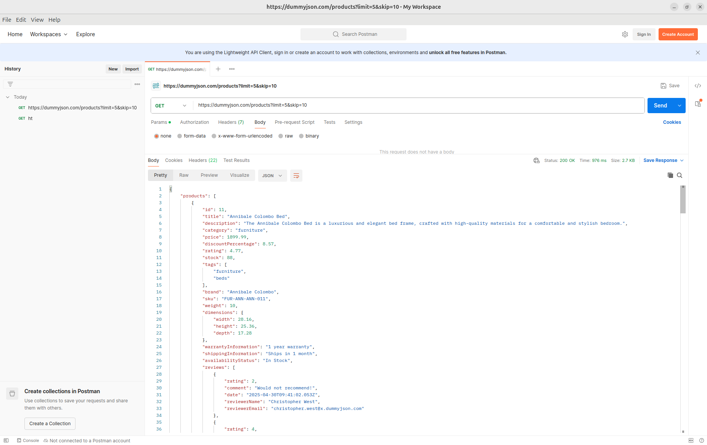
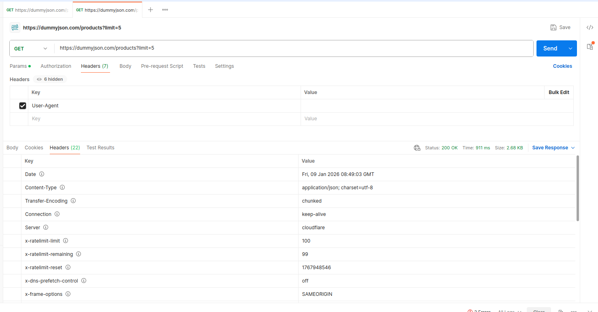
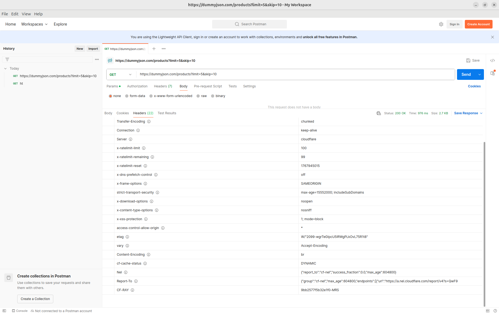
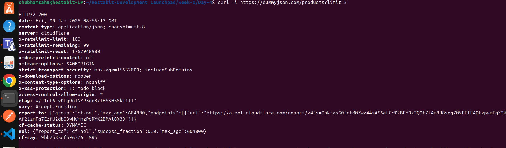

# DAY 4 — HTTP / API FORENSICS (CURL + POSTMAN)

## Overview
This document contains the complete API investigation performed using `curl` and HTTP concepts.
It includes DNS lookup, traceroute, request/response inspection, headers manipulation,
pagination behavior, and caching using ETag.

All commands and outputs are captured as terminal-style logs (paths/usernames removed).

---

## 1. DNS Lookup

### Command
```bash
nslookup dummyjson.com
```

### Output
```
Server:  127.0.0.53
Address: 127.0.0.53#53

Non-authoritative answer:
Name: dummyjson.com
Address: 172.67.205.42
Address: 104.21.61.23
Address: 2606:4700:3031::ac43:cd2a
Address: 2606:4700:3033::6815:3d17
```

---

## 2. Traceroute

### Command
```bash
traceroute dummyjson.com
```

### Output
```
traceroute to dummyjson.com (172.67.205.42), 30 hops max
 1  _gateway (10.10.0.1)
 2  14.96.247.185
 3  *
 4  203.132.144.109
 5  182.79.146.236
 6  162.158.20.18
 7  162.158.20.42
 8  172.67.205.42
```

---

## 3. API Request with Pagination

### Command
```bash
curl -v https://dummyjson.com/products?limit=5&skip=10
```


### Observations
- `limit` controls number of items returned
- `skip` controls offset
- HTTP/2 used
- JSON response received with product list
- Response headers show rate limiting and caching behavior

---

## 4. Header Manipulation

### Remove User-Agent

```bash
curl -v -H "User-Agent:" https://dummyjson.com/products?limit=5
```


**Result:**
- Request still succeeds
- Server does not strictly require User-Agent

---

### Fake Authorization Header

```bash
curl -v -H "Authorization: Bearer FAKE_TOKEN" https://dummyjson.com/products?limit=5
```

**Result:**
- No authentication enforced for this endpoint
- Response unchanged

---

## 5. Caching & ETag

### Fetch Headers


```bash
curl -I https://dummyjson.com/products?limit=5
```

### Observed Header
```
etag: W/"1cf6-vKLgOnINYP3dn8/IH5KH5MkT1tI"
```

### Conditional Request

```bash
curl -v -H 'If-None-Match: W/"1cf6-vKLgOnINYP3dn8/IH5KH5MkT1tI"' https://dummyjson.com/products?limit=5
```

### Result
- Server still returned `200 OK`
- Cloudflare marks response as `DYNAMIC`
- Indicates API responses are not cached as static assets

---

## 6. Request–Response Cycle Summary

1. DNS resolves domain to IP
2. TCP + TLS handshake
3. HTTP/2 stream opened
4. Headers sent
5. Server responds with headers + JSON body
6. Connection reused

---

## Conclusion

- Pagination is client-driven via query params
- Headers influence behavior but are not mandatory
- ETag exists but caching is disabled for dynamic data
- Cloudflare sits as reverse proxy
- API is public and read-only

---

**Author:** Shubham Sahu  
**Program:** Hestabit Development Launchpad  
**Day:** 4
