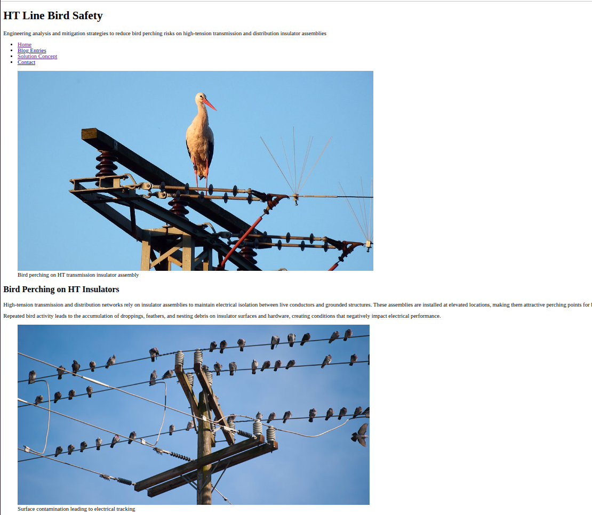
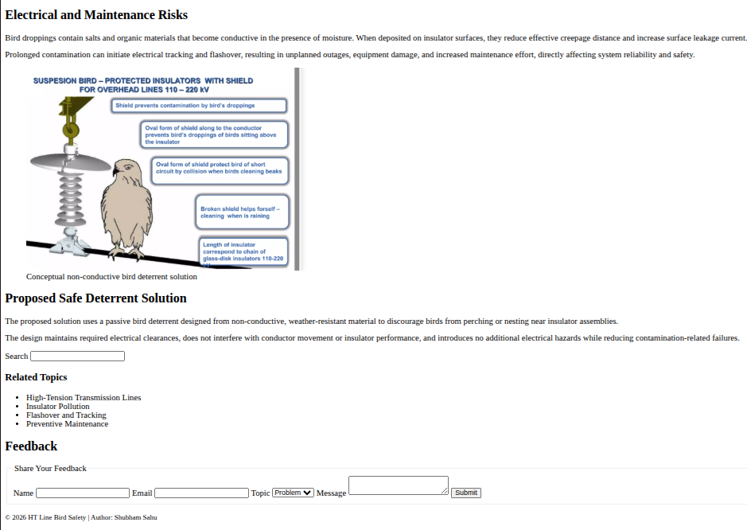

# Week 2 – Day 1: Semantic HTML Layout

This task demonstrates building a complete web page using **semantic HTML5 only**.
No CSS or JavaScript is used.

---

## Task Scope

- Semantic HTML page structure
- No usage of `
`
- Form elements with validation
- Image embedding
- Accessibility attributes
- Clean documentation

---

## Implementation Summary

### HTML Structure
- Used semantic layout elements:
  `header`, `nav`, `main`, `section`, `article`, `aside`, `footer`

### Forms
- Implemented using:
  `form`, `fieldset`, `legend`
- Inputs used:
  `input` (text, email, search), `select`, `textarea`, `button`
- Native validation via `required`

### Media
- Images embedded using `figure`, `img`, `figcaption`
- No video or iframe used

### Accessibility
- `aria-label` for navigation and landmarks
- `alt` text for all images
- `tabindex="0"` for keyboard navigation
- Proper `label` associations for form controls

---

## Constraints Followed

- No CSS
- No JavaScript
- No `
` elements
- Semantic tags only

---

## Output Preview

### Screenshot 1

### Screenshot 2

---