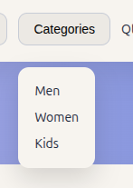
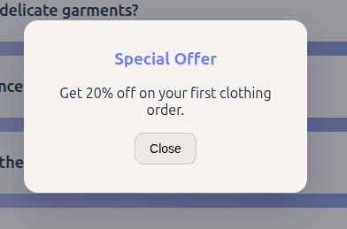
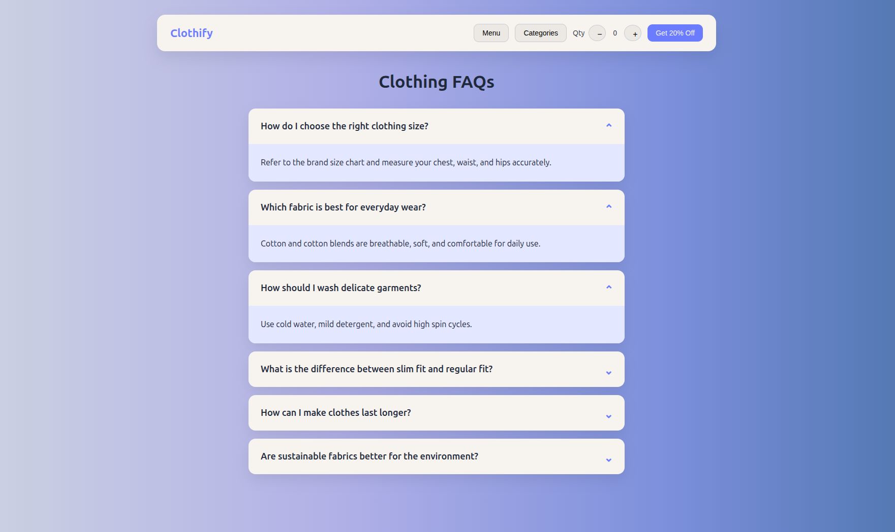

# JS DOM Practice – Clothing FAQ

## Features Implemented
- **Navbar:** Header with menu, categories dropdown, quantity counter, and offer button.
- **Dropdown:** Categories dropdown toggled using click event listener.
- **Quantity Counter:** Increment and decrement quantity using + and − buttons with event listeners.
- **Modal:** Offer modal opens and closes using click-based event listeners.
- **FAQ Section:** Click-to-expand clothing FAQs using DOM manipulation and event listeners.
- **Styling:** Card-based layout with left-to-right gradient background.

## JavaScript Concepts Used
- Event listeners for clicks
- DOM selection and class toggling
- Dynamic UI updates

## Screenshots

## How to Run
- Open `index.html` in a browser.

## Notes
- No Enter key usage, only click events.
- Built using HTML, CSS, and Vanilla JavaScript only.
