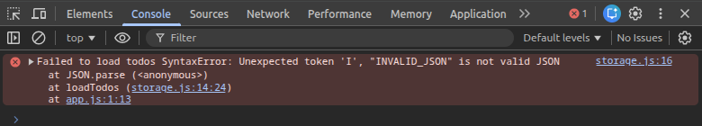

## Error Handling – Invalid LocalStorage Data



### Error Triggered
The error was triggered by manually storing invalid JSON in LocalStorage and refreshing the page:

```js
localStorage.setItem("todos", "INVALID_JSON");
location.reload();

### What Occurred

On reload, the application attempted to parse the stored value using `JSON.parse()`.  
Since the value was not valid JSON, a `SyntaxError` was thrown and caught by the `try/catch` block.

### Why It Occurred

The application expects valid JSON data for the `todos` key.  
Manually inserting corrupted data breaks this expectation and causes parsing to fail.

### How It Was Resolved

The error was safely handled using `try/catch`, preventing the app from crashing.  
On failure, the application falls back to an empty todo list and continues functioning normally.
