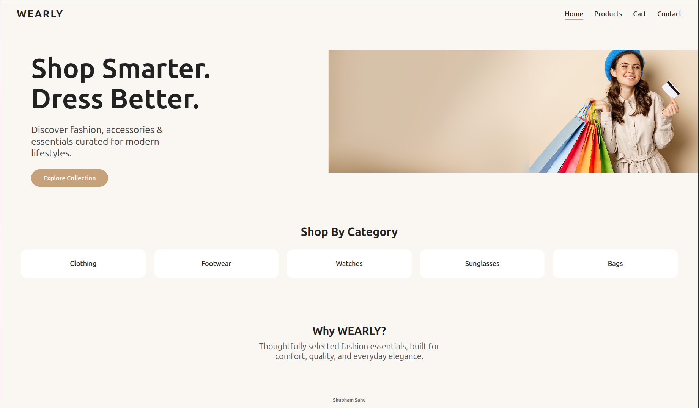
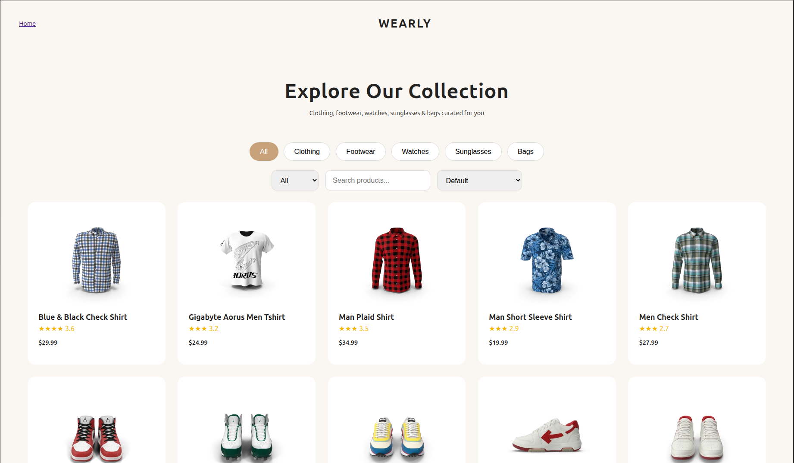
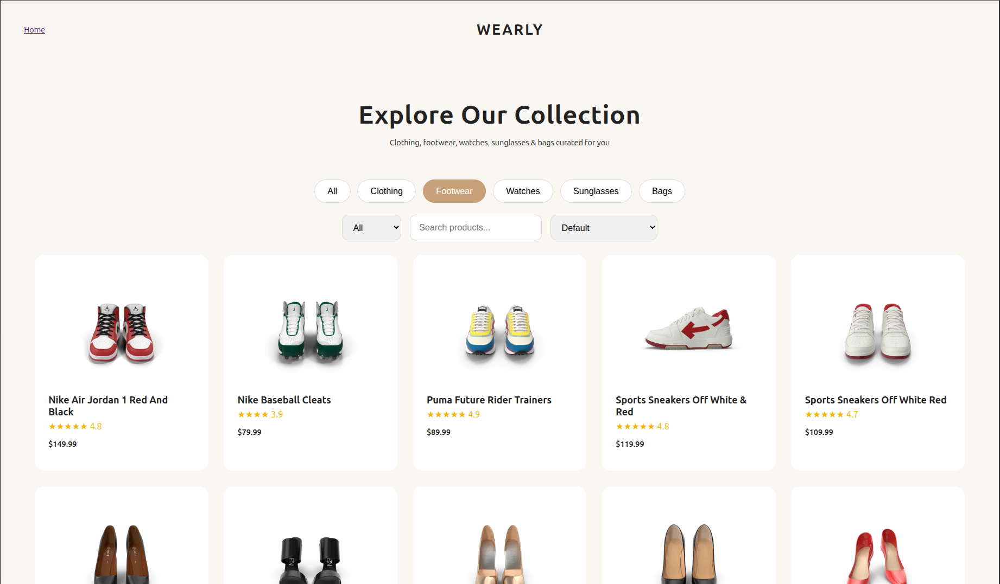
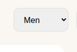
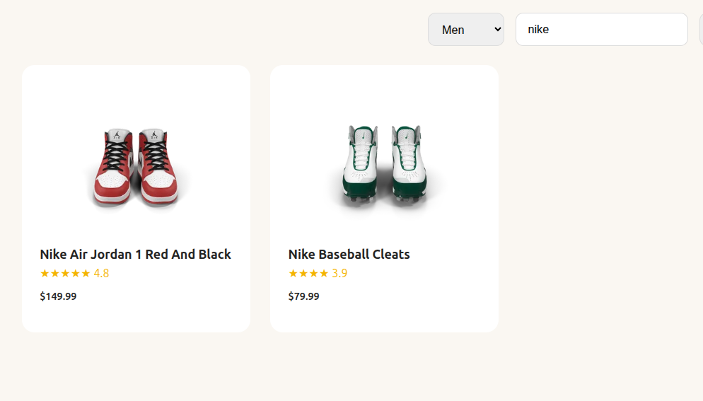
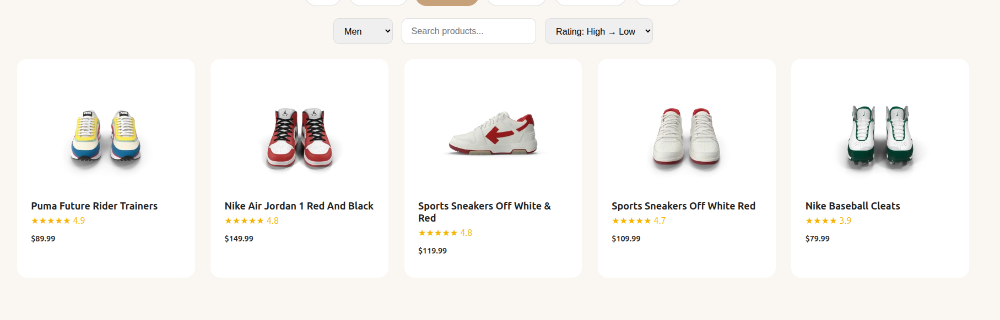
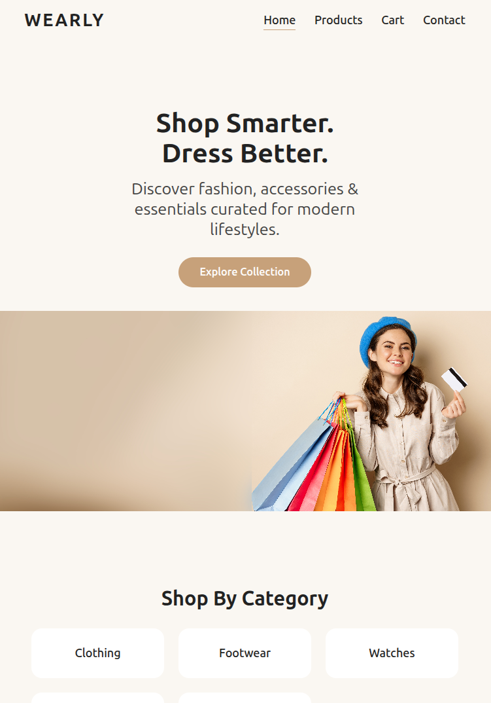

# WEARLY – Frontend Practice Project

This project was created as part of my **frontend learning journey**.  
The main goal was to practice **HTML, CSS, and JavaScript concepts** by building a small e-commerce–style user interface and understanding how real websites are structured and behave.

---

## 📸 Screenshots

### Home Page
Shows the main landing layout with navbar, hero section, and categories.

---

### Products Page
Displays all products in a grid with filters and sorting options.

---

### Category Selection (Footwear Example)
Products filtered by a selected category.

---

### Gender Filter
Filtering products based on gender (Men/Women).

---

### Search Functionality
Search input filtering products by name.

---

### Rating Filter (High → Low)
Products sorted based on rating.

---

### Responsive Layout
Demonstrates how the layout adapts across different screen sizes.

---

## 🎯 Purpose of This Project

- Practice building layouts similar to real e-commerce websites
- Understand spacing, alignment, and responsiveness
- Learn how frontend filtering logic works
- Improve confidence in writing clean HTML, CSS, and JavaScript

---

## 🧠 What I Learned

### HTML
- Structuring pages using semantic HTML elements
- Dividing layouts into navbar, hero, categories, products, and footer
- Writing readable and maintainable HTML for larger pages

### CSS
- Using **Flexbox and Grid** for layout creation
- Controlling spacing using padding, margin, and height
- Fixing extra white-space issues between sections
- Making layouts responsive using media queries
- Improving typography hierarchy using font sizes and line heights
- Building scalable product grids (desktop → tablet → mobile)

### JavaScript
- Rendering product data dynamically
- Implementing product filtering based on:
  - Category
  - Gender
  - Search input
  - Rating (High → Low, Low → High)
- Managing UI state (active filters, selected tabs)
- Understanding real-world frontend filtering logic

---

## 🚧 Problems Faced & Fixes

- **Too much spacing between sections**  
  → Reduced padding and min-height values

- **Hero section taking too much screen height**  
  → Adjusted grid structure and alignment

- **Product cards appearing too small**  
  → Updated grid column count and card sizing

- **Filters not feeling intuitive**  
  → Improved spacing and layout of filter controls

These problems helped me understand how small CSS and layout changes can strongly affect the overall UI.

---

## 🛠️ Tech Used

- HTML5  
- CSS3  
- JavaScript (Vanilla)

---

This project represents my practical learning and gradual improvement in frontend development.
