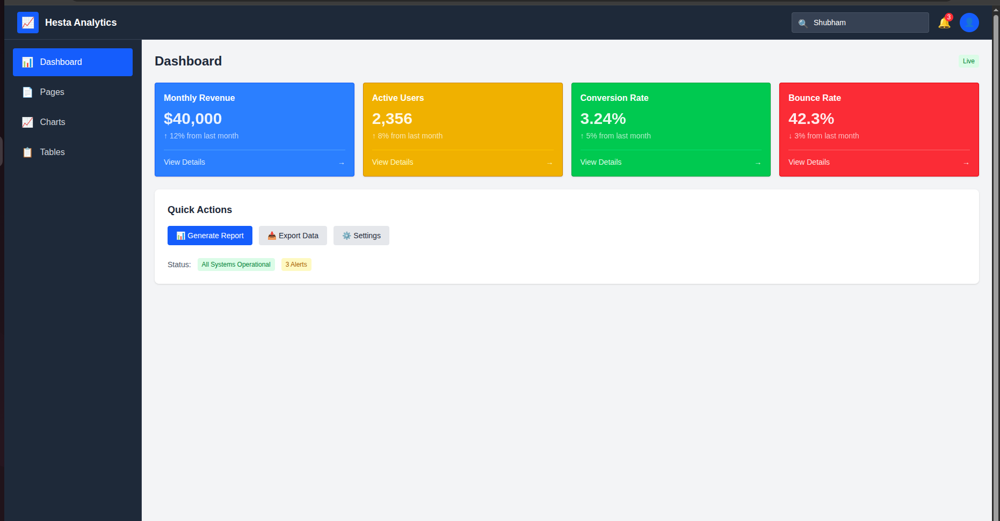
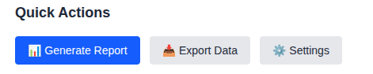
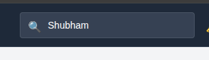
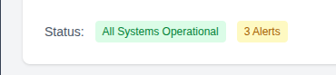
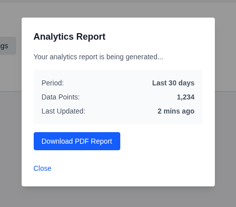
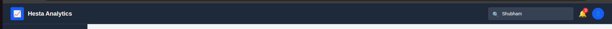
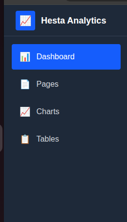

# UI Component Quick Guide

---
## DAY-2 Dashboard

---

## 🔘 Button

Three styles for different actions: Primary (blue), Secondary (gray), Danger (red).

**When to use:** Any clickable action - submit forms, open modals, delete items.

---

## 📝 Input

Clean text input with blue focus ring.

**When to use:** Forms, search bars, any text entry.

---

## 🃏 Card

Container with 5 color variants. Optional footer with arrow.

**When to use:** Dashboard stats, info blocks, grouped content.

---

## 🏷️ Badge

Small colored labels - Default (gray), Success (green), Warning (yellow), Danger (red).

**When to use:** Status indicators, tags, notifications.

---

## 🪟 Modal

Pop-up overlay with title and close button.

**When to use:** Confirmations, forms, detailed info display.

---

## 🧭 Navbar

Dark theme top bar with logo, search, notifications, and user icon.

**When to use:** Main site navigation (already in layout).

---

## 📑 Sidebar

Dark theme side menu with icons and active states.

**When to use:** Page navigation (already in layout).

---

## 💡 Quick Tips

- **Import:** `import Button from "../components/ui/Button"`
- **Add state:** Put `"use client"` at top of file
- **Variants:** Optional - defaults work fine
- **Mix them:** Cards + Badges + Buttons = powerful UIs

---
