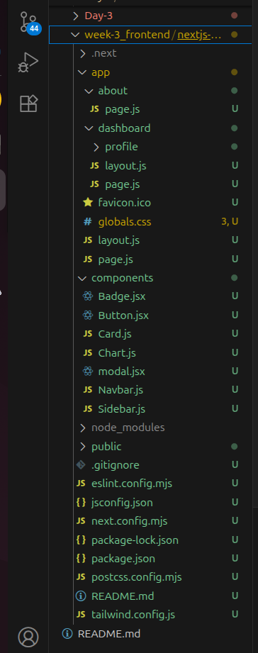
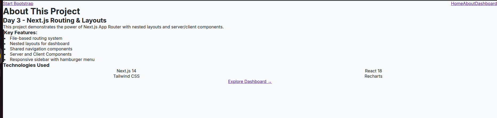
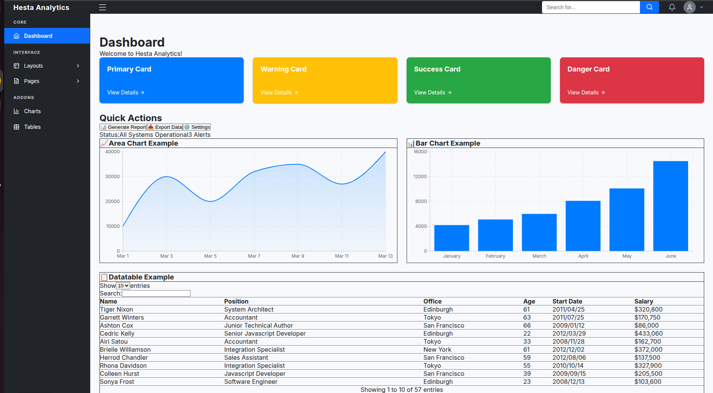
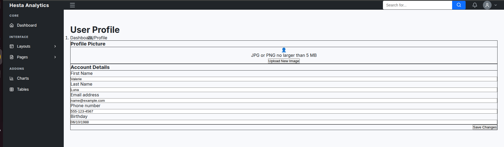

# Day 3 — Next.js Routing & Layout System

## What I Learned (New Concepts)

On Day 3, I learned how **Next.js App Router** works using **folder-based routing** and **nested layouts**.

Key learnings:
- Routing is created automatically using folders like `page.js`
- Nested folders create nested routes (e.g. `/dashboard/profile`)
- Layouts are hierarchical:
  - `app/layout.js` is the root layout and must contain `<html>` and `<body>`
  - Route-level layouts (e.g. `dashboard/layout.js`) wrap only their own pages
- Difference between **Server Components (default)** and **Client Components (`"use client"`)**
- How to share UI (Navbar, Sidebar) only where needed using nested layouts

---

## How This Builds on Day 2

On Day 2, I focused on **UI building and components**.  
On Day 3, I reused the **same completed UI** and converted it into a **multi-page application** using routing and layouts.

This helped me understand how real projects organize UI and navigation.

---

## Exercise Completed

Built a multi-page structure using Next.js routing:
- `/` → Landing page  
- `/about`
- `/dashboard`
- `/dashboard/profile`

The dashboard uses a **nested layout** with shared Navbar and Sidebar.

---

## Output

- Working folder-based routing
- Nested layouts applied correctly
- Shared dashboard navigation
- Code pushed inside **`week3-frontend`** folder for **uniformity and reusability**

---

## Screenshots

### Folder Structure

### Landing Page

### About Page

### Dashboard Page

### Profile Page

