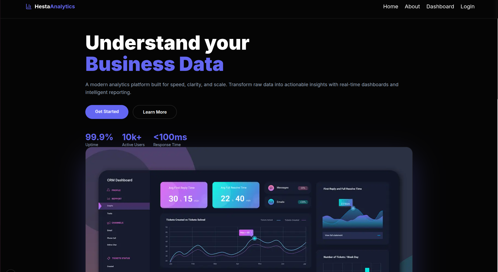
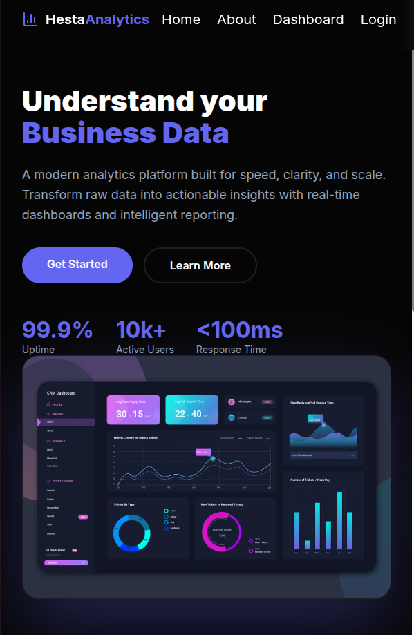
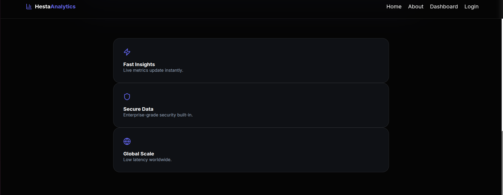
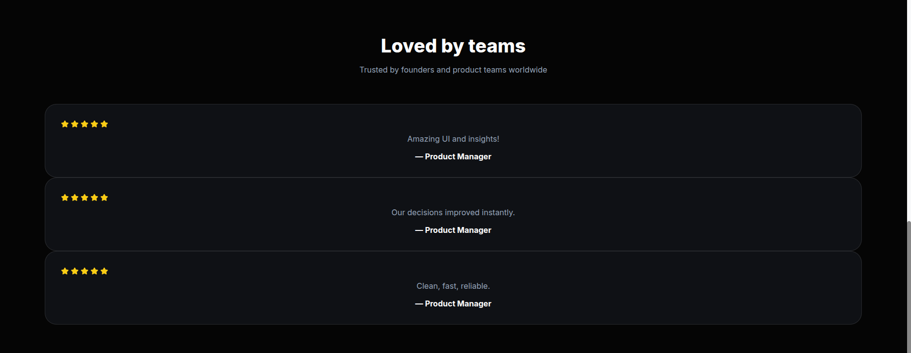

# Day 4 — Dynamic UI & Image Optimization

## 📘 Learnings & Implementation

- Used **`next/image`** to render optimized and responsive images, improving performance and loading behavior.
- Learned how **responsive images** adapt across screen sizes using layout-aware sizing.
- Built a **SaaS-style landing page** structure with clear sections:
  - Hero section
  - Features grid
  - Testimonials (card-based layout)
  - Footer
- Applied **modern typography practices**:
  - Proper heading hierarchy
  - Scalable font sizes for better readability
- Understood **SEO basics in Next.js App Router**, including:
  - Metadata usage
  - Limitations of exporting metadata in client components
- Implemented **dark-themed UI design** with consistent spacing, alignment, and visual hierarchy.
- Created reusable UI blocks (feature cards, testimonial cards) with clean layout and styling.
- Focused on **real-world UI structure** similar to production SaaS websites.

---

## 🖼️ Screenshots

### Landing Page

### Responsive View

### Features Section

### Testimonials Section

---
