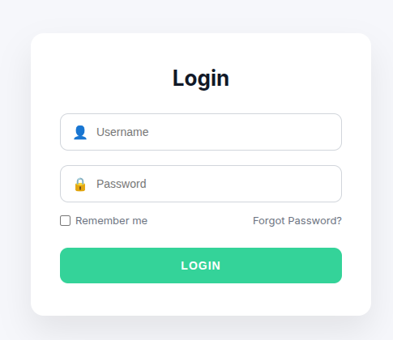
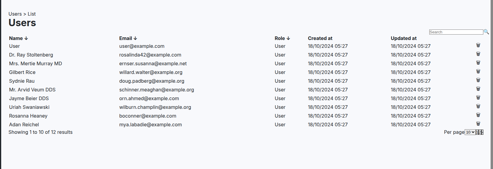

# 📊 Week 3 - Next.js + Tailwind Frontend

A modern analytics dashboard built with Next.js 14, Tailwind CSS, and Framer Motion. This project demonstrates advanced frontend concepts including routing, component reusability, responsive design, and animation.

---

## 📸 Screenshots


### Login Page

*Clean authentication interface with form validation*

### User Profile

*User management interface with profile settings*

### Users List

*Comprehensive user directory with search and filtering*

---

## 📁 Folder Structure
```
week-3-next-tailwind-frontend/
├── app/
│   ├── about/
│   │   └── page.js                 # About page
│   ├── dashboard/
│   │   ├── profile/
│   │   │   └── page.js            # User profile page
│   │   ├── users/
│   │   │   ├── layout.js          # Users section layout
│   │   │   └── page.js            # Users list page
│   │   ├── layout.js              # Dashboard layout with sidebar
│   │   └── page.js                # Main dashboard page
│   ├── login/
│   │   └── page.js                # Login/Authentication page
│   ├── components/
│   │   ├── Badge.jsx              # Status badge component
│   │   ├── Button.jsx             # Reusable button component
│   │   ├── Card.jsx               # Card wrapper component
│   │   ├── Chart.js               # Chart visualization component
│   │   ├── modal.jsx              # Modal dialog component
│   │   ├── Navbar.js              # Navigation bar
│   │   └── Sidebar.js             # Dashboard sidebar
│   ├── globals.css                # Global styles and Tailwind imports
│   ├── layout.js                  # Root layout with metadata
│   └── page.js                    # Landing page (home)
├── public/
│   ├── dashboard-preview.png      # Hero section image
│   └── favicon.ico                # Site favicon
├── .next/                         # Next.js build output
├── node_modules/                  # Dependencies
├── package.json                   # Project dependencies
├── tailwind.config.js             # Tailwind configuration
├── postcss.config.js              # PostCSS configuration
└── README.md                      # Project documentation
```

---

## 🧩 Components List

### UI Components (`/app/components/`)

| Component | Purpose | Reusable | Props |
|-----------|---------|----------|-------|
| **Badge.jsx** | Status indicators (Active, Pending, Inactive) | ✅ Yes | `status`, `children` |
| **Button.jsx** | Primary/Secondary action buttons | ✅ Yes | `variant`, `size`, `onClick`, `children` |
| **Card.jsx** | Container for dashboard widgets | ✅ Yes | `title`, `value`, `icon`, `trend` |
| **Chart.js** | Data visualization (Line, Bar, Pie) | ✅ Yes | `type`, `data`, `options` |
| **modal.jsx** | Popup dialogs for forms/confirmations | ✅ Yes | `isOpen`, `onClose`, `title`, `children` |
| **Navbar.js** | Top navigation with logo and links | ✅ Yes | `transparent` (boolean) |
| **Sidebar.js** | Dashboard side navigation | ✅ Yes | `activeRoute` |

### Page Components

| Page | Route | Features |
|------|-------|----------|
| **Landing** | `/` | Hero section, features grid, testimonials, footer |
| **About** | `/about` | Company information, team details |
| **Login** | `/login` | Authentication form, social login options |
| **Dashboard** | `/dashboard` | Analytics overview, metrics cards, charts |
| **Profile** | `/dashboard/profile` | User settings, avatar upload, preferences |
| **Users** | `/dashboard/users` | User management table, search, filters |

---

## 🎨 Design Patterns Used

### 1. **Component Reusability**
```javascript
// Reusable Card component used across dashboard
<Card 
  title="Total Users" 
  value="12,543" 
  icon={Users} 
  trend="+12.5%" 
/>
```

### 2. **Layout Nesting**
```
app/layout.js (root)
  └── dashboard/layout.js (with sidebar)
      └── users/layout.js (with filters)
          └── page.js (users table)
```

### 3. **Glassmorphism Effect**
```css
.glass-card {
  background: rgba(15, 17, 21, 0.8);
  backdrop-filter: blur(10px);
  border: 1px solid rgba(255, 255, 255, 0.1);
}
```

---

## 🚀 Features Implemented

### Week 3 Learning Goals

#### ✅ Day 1-3: Next.js Fundamentals
- [x] File-based routing (`app/` directory)
- [x] Nested layouts (dashboard layout with sidebar)
- [x] Dynamic routing (`/dashboard/users/[id]`)
- [x] Server Components vs Client Components
- [x] Metadata API for SEO

#### ✅ Day 4: Dynamic UI + Image Optimization
- [x] `next/image` with optimization
- [x] Responsive images with `sizes` prop
- [x] Typography hierarchy (h1-h6)
- [x] SEO metadata (title, description, OG tags)
- [x] Framer Motion animations
- [x] Tailwind responsive classes

#### ✅ Day 5: Component Architecture
- [x] Reusable UI components library
- [x] Clean routing structure
- [x] Mobile-first responsive design
- [x] Component composition patterns

---

## 📚 Lessons Learned

### 1. **Next.js App Router**
The new App Router in Next.js 14 provides a more intuitive way to structure applications:
- **Layouts** reduce code duplication (navbar, sidebar)
- **Server Components** by default improve performance
- **File-based routing** is cleaner than traditional routing libraries

**Challenge Faced:** Understanding when to use `'use client'` directive.
**Solution:** Only use it when components need interactivity (state, events, browser APIs).

### 2. **Tailwind CSS Responsive Design**
Mobile-first approach makes responsive design easier:
```javascript
// Mobile → Tablet → Desktop
className="grid grid-cols-1 sm:grid-cols-2 lg:grid-cols-3"
```

**Challenge Faced:** Custom color values in Tailwind.
**Solution:** Use arbitrary values with `[]` notation: `bg-[#050505]`

### 3. **Image Optimization**
`next/image` automatically optimizes images:
- Lazy loading by default
- WebP conversion for modern browsers
- Responsive with `sizes` prop

**Best Practice Learned:**
```javascript
<Image
  src="/dashboard-preview.png"
  alt="Descriptive alt text for accessibility"
  width={1200}
  height={700}
  priority // For above-the-fold images
  sizes="(max-width: 768px) 100vw, 50vw"
/>
```

### 4. **Component Reusability**
Creating a component library saved development time:

**Before (Repetitive):**
```javascript
<div className="bg-card p-6 rounded-lg">...</div>
<div className="bg-card p-6 rounded-lg">...</div>
```

**After (Reusable):**
```javascript
<Card>...</Card>
<Card>...</Card>
```

### 5. **Animation Performance**
Framer Motion provides smooth animations without complexity:
- Use `whileInView` for scroll animations
- `staggerChildren` creates cascading effects
- Always set `viewport={{ once: true }}` to prevent re-animation

**Performance Tip:** Animate only `transform` and `opacity` for 60fps.

### 6. **SEO Best Practices**
Implementing proper metadata is crucial:
```javascript
// app/layout.js
export const metadata = {
  title: 'HestaAnalytics - Business Analytics',
  description: 'Transform data into insights',
  openGraph: { ... },
  twitter: { ... }
}
```

### 7. **Routing Strategy**
Organized routes improve maintainability:
- **Public routes:** `/`, `/about`, `/login`
- **Protected routes:** `/dashboard/*` (with authentication check)
- **Nested routes:** `/dashboard/users`, `/dashboard/profile`

---

## 🛠️ Tech Stack

| Technology | Purpose |
|------------|---------|
| **Next.js 14** | React framework with App Router |
| **React 18** | UI library |
| **Tailwind CSS** | Utility-first CSS framework |
| **Framer Motion** | Animation library |
| **Lucide React** | Icon system |
| **PostCSS** | CSS processing |

---

## 📦 Installation & Setup
```bash

# Run development server
npm run dev

```
---

## 🎯 Key Takeaways

1. **Next.js App Router** is more intuitive than Pages Router
2. **Tailwind CSS** speeds up development with utility classes
3. **Component libraries** reduce code duplication
4. **Framer Motion** makes animations simple and performant
5. **SEO metadata** is essential for discoverability
6. **Mobile-first design** ensures better user experience
7. **Image optimization** significantly improves performance

---

## 🔗 Useful Resources

- [Next.js Documentation](https://nextjs.org/docs)
- [Tailwind CSS Docs](https://tailwindcss.com/docs)
- [Framer Motion Guide](https://www.framer.com/motion/)
- [Lucide Icons](https://lucide.dev/)

---

## 📝 Code Review

For detailed code review and implementation details, visit the full project repository:
👉 **[Week 3 Project Repository](https://github.com/yourusername/week-3-next-tailwind-frontend)**

---

## 👨‍💻 Author

**Your Name**  
- GitHub: [@yourusername](https://github.com/yourusername)
- LinkedIn: [Your Profile](https://linkedin.com/in/yourprofile)

---

## 📄 License

This project is created for educational purposes as part of a web development learning curriculum.

---

**Built with ❤️ using Next.js and Tailwind CSS**