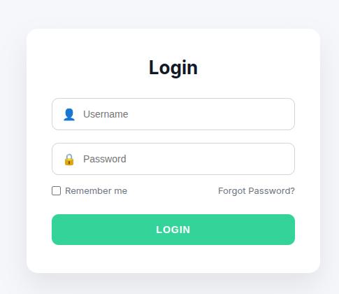
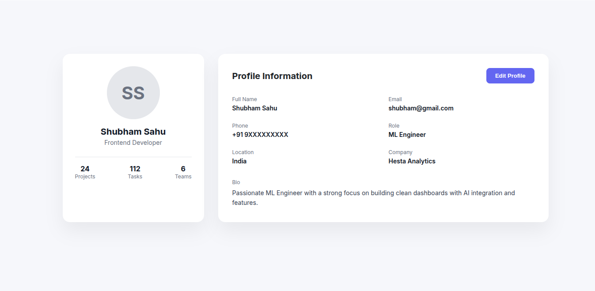
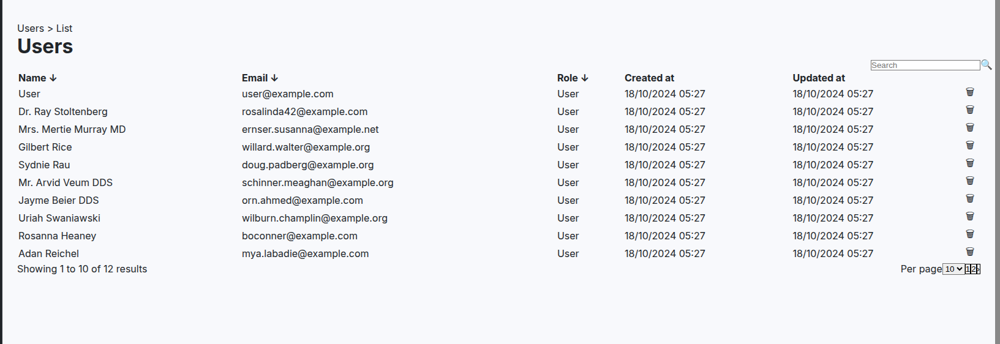

# Week 3 - Next.js + Tailwind Frontend

A modern analytics dashboard built with Next.js 14, Tailwind CSS, and
Framer Motion. This project demonstrates advanced frontend concepts
including routing, component reusability, responsive design, and
animation.

------------------------------------------------------------------------

## Screenshots

### Login Page

 Clean authentication interface
with form validation

### User Profile

 User management
interface with profile settings

### Users List

 Comprehensive user directory with
search and filtering

------------------------------------------------------------------------

## Folder Structure

    week-3-next-tailwind-frontend/
    ├── app/
    │   ├── about/
    │   │   └── page.js
    │   ├── dashboard/
    │   │   ├── profile/
    │   │   │   └── page.js
    │   │   ├── users/
    │   │   │   ├── layout.js
    │   │   │   └── page.js
    │   │   ├── layout.js
    │   │   └── page.js
    │   ├── login/
    │   │   └── page.js
    │   ├── components/
    │   │   ├── Badge.jsx
    │   │   ├── Button.jsx
    │   │   ├── Card.jsx
    │   │   ├── Chart.js
    │   │   ├── modal.jsx
    │   │   ├── Navbar.js
    │   │   └── Sidebar.js
    │   ├── globals.css
    │   ├── layout.js
    │   └── page.js
    ├── public/
    │   ├── dashboard-preview.png
    │   └── favicon.ico
    ├── .next/
    ├── node_modules/
    ├── package.json
    ├── tailwind.config.js
    ├── postcss.config.js
    └── README.md

------------------------------------------------------------------------

## Project Structure Clarification

This week was designed as a step-by-step learning progression, where
each day builds on the previous one.

-   Day 1 to Day 4 focus on incremental development of features and
    concepts.
-   Each day introduces new functionality, improvements, and
    refinements.

To keep the project clean and practical:

-   The final consolidated implementation is available in Day-5.
-   Day-5 represents the complete version of the project, combining all
    learnings from the week.
-   Earlier days are kept for learning reference and progression
    tracking, while Day-5 serves as the production-ready structure.

This approach ensures: - Clear understanding of project evolution - Easy
access to the final working version - Better organization within a
single folder for the entire week

------------------------------------------------------------------------

