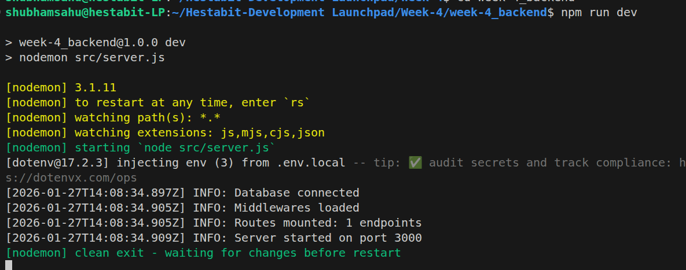

# Week 4 – Backend Architecture (Day 1)



## Overview

This document describes the backend architecture implemented on **Day 1 of Week 4**.  
The focus of this day was setting up a clean Node.js project structure, environment-based configuration, and loader-driven application bootstrapping.

The complete backend setup can be found inside the **`week4_backend/`** folder.  
This same base structure will be used throughout Week 4, and this document will be updated daily as new concepts and features are added.

---

## What Was Implemented

### Configuration
- Environment isolation using `.env.local`, `.env.dev`, and `.env.prod`
- Centralized configuration loader based on `NODE_ENV`

### Loaders
- App loader to initialize Express, middlewares, and routes
- Database loader to handle database initialization
- Controlled and predictable startup flow using loaders

### Core Files
- `server.js` used as the single application entry point
- `loaders/app.js` responsible for Express setup
- `loaders/db.js` responsible for database initialization
- `utils/logger.js` used for centralized logging

---

## Folder Structure

```
week4_backend/
├── src/
│   ├── config/
│   ├── loaders/
│   │   ├── app.js
│   │   └── db.js
│   ├── models/
│   ├── routes/
│   ├── controllers/
│   ├── services/
│   ├── repositories/
│   ├── middlewares/
│   ├── utils/
│   │   └── logger.js
│   ├── jobs/
│   ├── logs/
│   └── server.js
│
├── .env.local
├── .env.dev
├── .env.prod
└── package.json
```

---

## Outcome

By the end of Day 1, the project has a clear startup flow, proper configuration management, and a scalable backend foundation that will be extended in the upcoming days without changing the core structure.