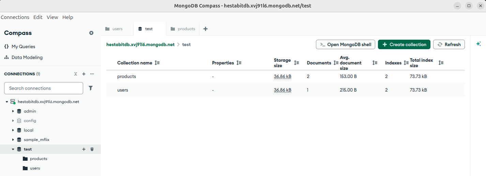
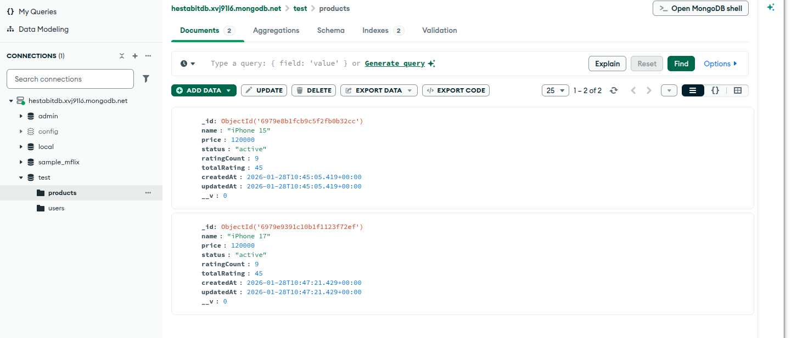
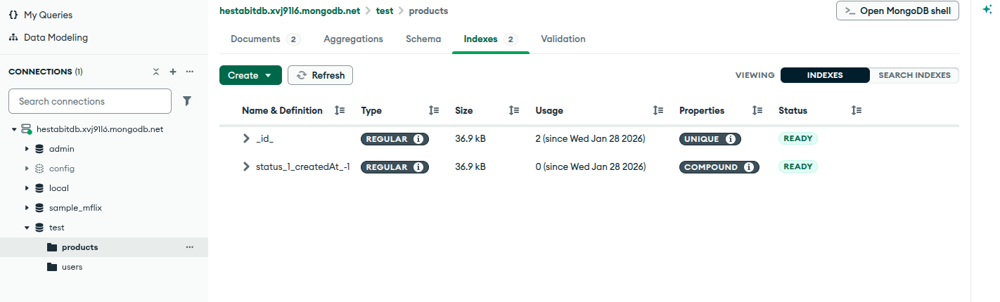
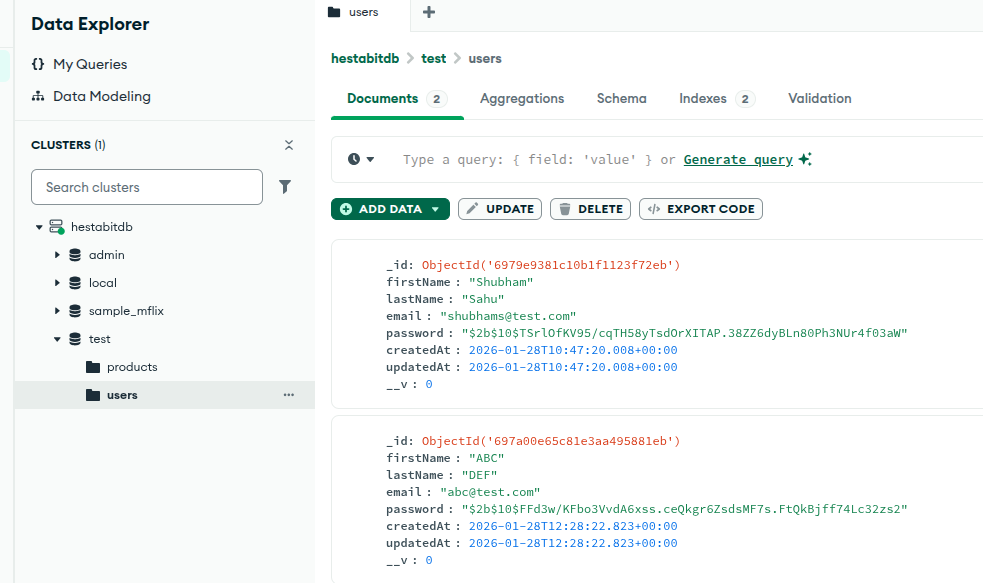
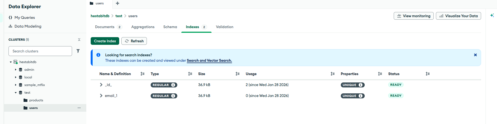

# Day 2 — Database Modeling, Indexing & Advanced CRUD

## 📌 Overview
Day 2 focused on **designing real-world database schemas using MongoDB & Mongoose**, implementing **indexes, hooks, virtual fields**, and following the **repository pattern** for clean data access.

All work is done inside the **same project structure from Day 1**.
For the Codes and files please Refer to week-4_backend folder
---

## 🗂️ Folder Structure (Same as Day 1)

```
src/
├── config/
│   └── index.js
├── loaders/
├── models/
│   ├── User.js
│   └── Product.js
├── repositories/
│   ├── user.repository.js
│   └── product.repository.js
├── routes/
├── controllers/
├── services/
├── middlewares/
├── utils/
├── jobs/
├── logs/
└── scripts/
    └── seed.js
```

---

## 🧩 Schema Highlights

### 👤 User Schema
- Fields: firstName, lastName, email, password
- Features:
  - **Pre-save hook** to hash password
  - **Virtual field**: `fullName`
  - **Unique index** on email

### 📦 Product Schema
- Fields: name, price, status, ratingCount, totalRating
- Features:
  - **Virtual field**: computed `rating`
  - **Compound index**: `{ status: 1, createdAt: -1 }`

---

## 🧱 Repository Pattern

### UserRepository
- `create()`
- `findById()`
- `findPaginated()`
- `update()`
- `delete()`

### ProductRepository
- `create()`
- `findById()`
- `findPaginated()`
- `update()`
- `delete()`

This ensures clean separation between business logic and database logic.

---

## 🧪 Seeding & Validation
- Seed script inserts sample User & Product
- Validates:
  - Password hashing
  - Virtual fields
  - Index enforcement (unique email)
  - Compound index creation

---

## 📸 MongoDB Compass – Index Analysis

### Atlas Connection


### Product Collection Document


### Product Indexes (Compound Index)


### User Collection Documents


### User Indexes (Unique Email)


These screenshots verify:
- Correct index creation
- Compound index on Product
- Unique index on User email

---

## ✅ Final Outcome
- All Day-2 requirements successfully implemented
- Indexes verified using MongoDB Compass
- Clean, scalable database design following best practices