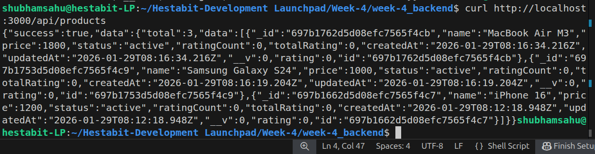
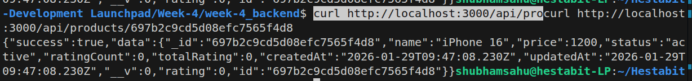
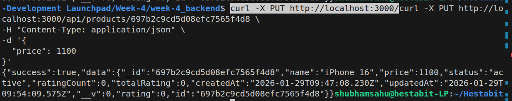
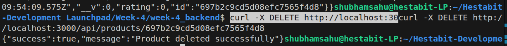
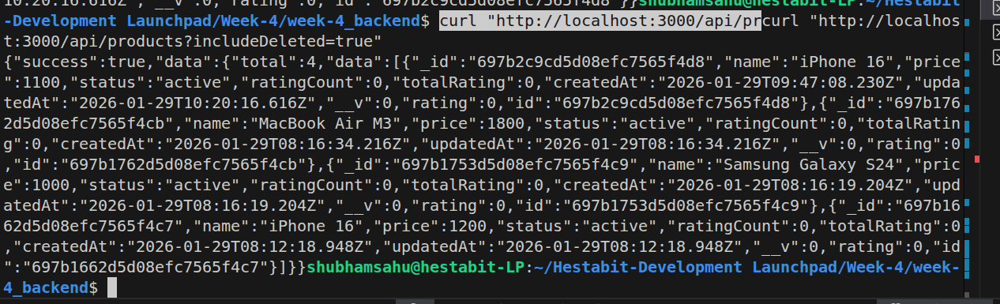
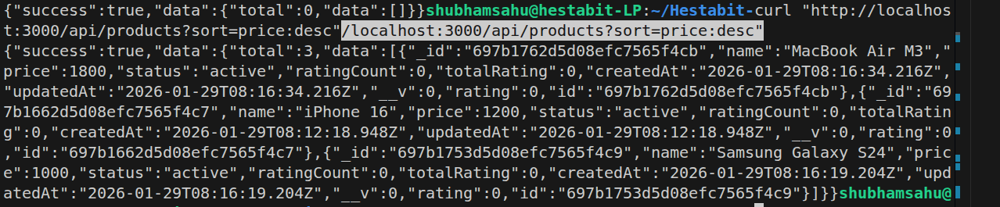
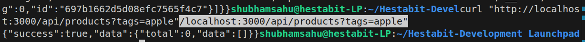
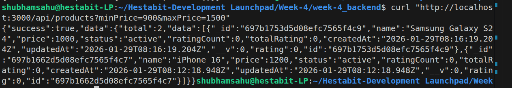
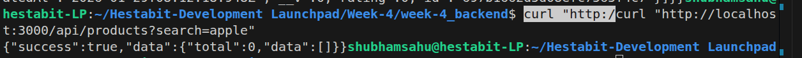

# QUERY-ENGINE-DOC.md

## Day-3: Query Engine & Product APIs

This document summarizes what I learned and implemented on **Day-3**, focusing on building a **query engine** and **ID-based operations** for Products using Node.js, Express, and MongoDB (Mongoose).

For the code please refer to files inside week-4_backend folder which is being updated day by day.

---

## What I Worked On (Day-3 Learnings)

- Implemented **Product CRUD APIs** with proper layering:
  - Controller → Service → Repository → Model
- Built a **Query Engine** supporting:
  - Search using regex
  - Filter by price range
  - Filter by tags
  - Sorting (asc/desc)
  - Pagination
- Implemented **ID-based operations**:
  - Get product by ID
  - Update product by ID
  - Soft delete product by ID
- Implemented **Soft Delete** using `deletedAt`
  - Deleted products are hidden by default
  - Can be viewed using `includeDeleted=true`
- Added **global error handling** using a custom `ApiError`

---

## Folder Structure (Day-3 Additions)

```
src/
├── controllers/
│   └── product.controller.js
├── services/
│   └── product.service.js
├── repositories/
│   └── product.repository.js
├── models/
│   └── Product.js
├── middlewares/
│   └── error.middleware.js
├── utils/
│   ├── apiError.js
│   └── logger.js
├── loaders/
│   ├── app.js
│   └── db.js
└── server.js
```

---

## Important API Commands Used

### Create Product
```bash
curl -X POST http://localhost:3000/api/products -H "Content-Type: application/json" -d '{
  "name": "iPhone 16",
  "description": "Apple flagship phone",
  "price": 1200,
  "tags": ["apple", "phone"]
}'
```

### Get All Products
```bash
curl http://localhost:3000/api/products
```

### Get Product by ID
```bash
curl http://localhost:3000/api/products/:id
```

### Update Product by ID
```bash
curl -X PUT http://localhost:3000/api/products/:id -H "Content-Type: application/json" -d '{ "price": 1100 }'
```

### Soft Delete Product by ID
```bash
curl -X DELETE http://localhost:3000/api/products/:id
```

### View Deleted Products
```bash
curl "http://localhost:3000/api/products?includeDeleted=true"
```

---

## Query Engine Examples

### Sorting (Descending)
```bash
curl "http://localhost:3000/api/products?sort=price:desc"
```

### Filter by Tags
```bash
curl "http://localhost:3000/api/products?tags=apple"
```

### Filter by Price
```bash
curl "http://localhost:3000/api/products?minPrice=1000&maxPrice=1500"
```

### Regex Search
```bash
curl "http://localhost:3000/api/products?search=iphone"
```

---

## Screenshots

### Product Created (ID Generated)


### Get All Products


### Get Product by ID


### Update by ID


### Soft Delete by ID


### Deleted Product Visible with includeDeleted=true


### Sorting (Desc)


### Filter by Tags


### Filter by Price


### Regex Search


---

## Key Takeaway

> Soft delete must be enforced at the query level, and query engines make APIs flexible, scalable, and production-ready.

---
