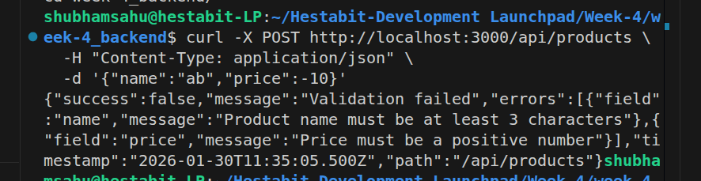
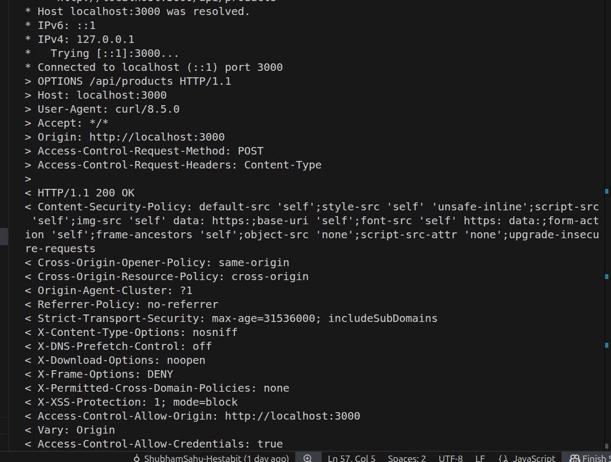
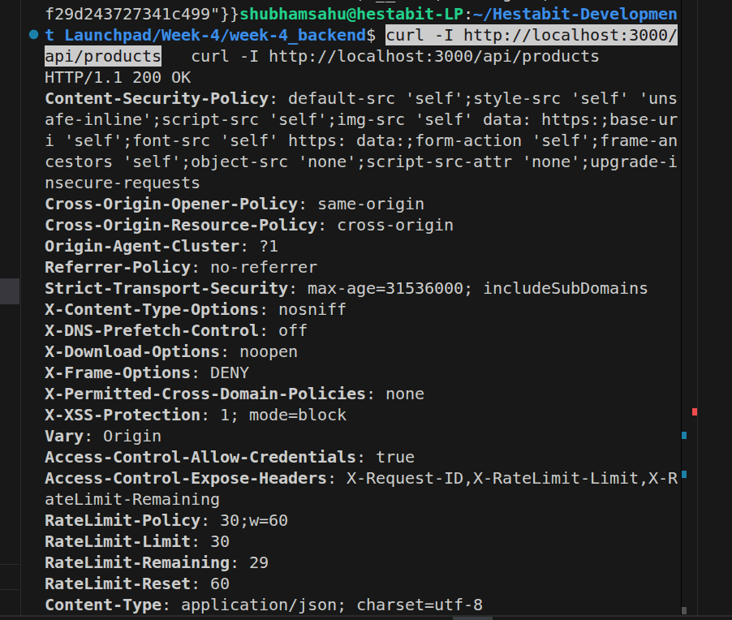
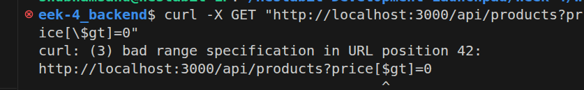
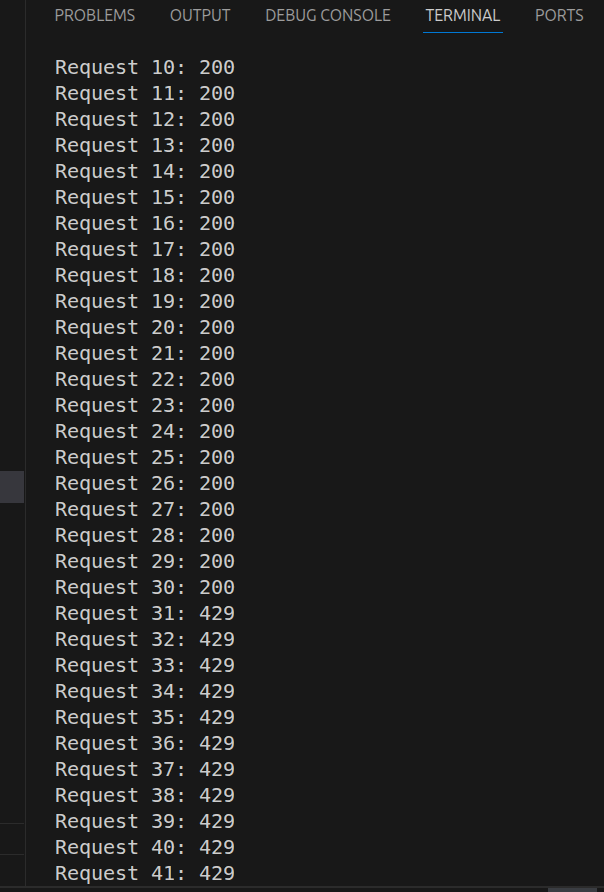

# Week-4 Backend API — Day 4 Security & Validation

> This document contains **Week-4 learning summary (Day 1–Day 4)** with **focus only on Day-4 security learnings** and **all security test commands** used during implementation.  
> Screenshots are stored inside the `screenshots/` folder.

---

# ✅ Day 4 – Security, Validation & Hardening (Main Focus)

## Key Learnings (Day-4 Only)

### 1. Request Validation (Zod)
- Validated request body, params, and query
- Blocked invalid data before controller
- Centralized reusable validation middleware



---

### 2. CORS Protection
- Restricted API access to trusted origins
- Blocked cross-origin abuse



---

### 3. Security Headers (Helmet)
- Added secure HTTP headers
- Protected against XSS, clickjacking, MIME sniffing



---

### 4. XSS Protection
- Prevented script injection attacks
- Sanitized malicious HTML/JS input


---

### 5. NoSQL Injection Prevention
- Blocked MongoDB operator injection
- Prevented query manipulation



---

### 6. Rate Limiting
- Limited number of requests per IP
- Prevented brute-force and API abuse



---

# 🧪 Day-4 Security Test Commands

## Validation Error Test
```bash
curl -X POST http://localhost:3000/api/products \
  -H "Content-Type: application/json" \
  -d '{"name":"ab","price":-10}'
```

---

## Global Rate Limiting (100 Requests)
```bash
for i in {1..110}; do 
  echo "Request $i: $(curl -s -o /dev/null -w "%{http_code}" http://localhost:3000/api/products)"
done
```

---

## API Rate Limiting (30 per minute)
```bash
for i in {1..35}; do 
  echo "Request $i: $(curl -s http://localhost:3000/api/products | jq -r '.success // .message' 2>/dev/null || echo 'Rate limited')"
  sleep 0.1
done
```

---

## NoSQL Injection Tests
```bash
curl -X GET "http://localhost:3000/api/products?price[\$gt]=0" -v
```

```bash
curl -X POST http://localhost:3000/api/products \
  -H "Content-Type: application/json" \
  -d '{"name":"Test","price":{"$gt":0},"status":"active"}'
```

---

## XSS Injection Test
```bash
curl -X POST http://localhost:3000/api/products \
  -H "Content-Type: application/json" \
  -d '{"name":"<script>alert(\"XSS\")</script>Product","description":"","price":100,"status":"active"}'
```

---

## HTTP Parameter Pollution (HPP)
```bash
curl -X GET "http://localhost:3000/api/products?sort=price:asc&sort=name:desc&sort=createdAt:asc" -v
```

---

## Security Headers Test
```bash
curl -I http://localhost:3000/api/products
```

---

## Payload Size Limit Test
```bash
python3 -c "import json; print(json.dumps({'name': 'x'*11000000, 'price': 100}))" > large.json
```

```bash
curl -X POST http://localhost:3000/api/products \
  -H "Content-Type: application/json" \
  -d @large.json
```

---

## CORS Tests
```bash
curl -H "Origin: http://malicious-site.com" \
     -H "Access-Control-Request-Method: POST" \
     -X OPTIONS \
     http://localhost:3000/api/products -v
```

```bash
curl -H "Origin: http://localhost:3000" \
     -H "Access-Control-Request-Method: POST" \
     -X OPTIONS \
     http://localhost:3000/api/products -v
```

---

## Invalid MongoDB ObjectId Test
```bash
curl -X GET http://localhost:3000/api/products/invalid-id-123
```

---

## Final Outcome (Day-4)
- APIs are validated and secure
- Malicious requests are blocked early
- Backend is production-hardened

---


