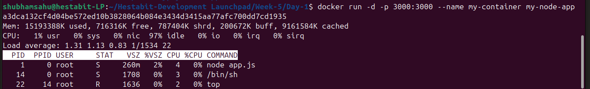
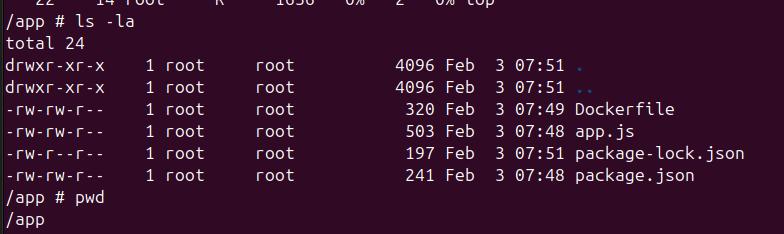
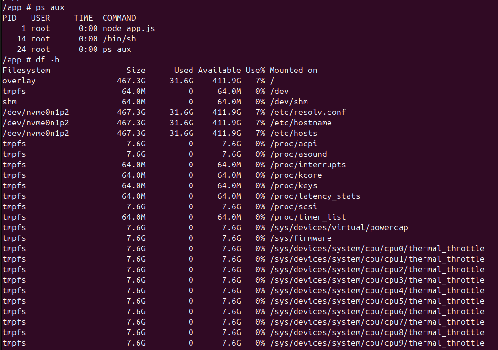
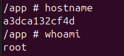
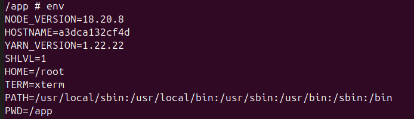
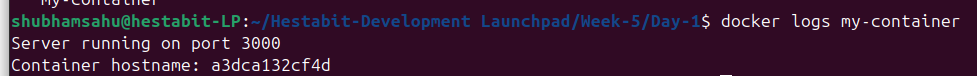
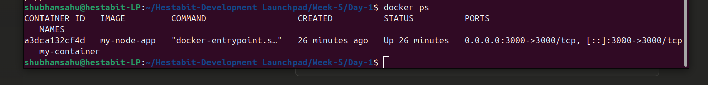
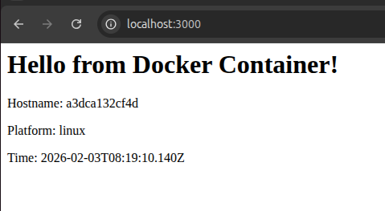

# Day 1: Linux in Container - Exploration Report

## Container Information
- **Container ID:** a3dca132cf4d
- **Image:** my-node-app (Node 18 Alpine)
- **Base OS:** Alpine Linux

---

## Commands Executed & Observations

### 1. Enter Container
```bash
docker exec -it my-container /bin/sh
```


---

### 2. Check Working Directory & Files
```bash
pwd
ls -la
```
**Output:** `/app` - Contains Dockerfile, app.js, package.json, node_modules



---

### 3. Running Processes
```bash
ps aux
```
**Key Finding:** Node.js app runs as PID 1 (main process)



---

### 4. System Info
```bash
hostname
whoami
```
**Output:** 
- Hostname: a3dca132cf4d (matches Container ID)
- User: root



---

### 5. Environment Variables
```bash
env
```
**Key Variables:** HOSTNAME, HOME, PWD, PATH, NODE_VERSION



---

### 6. View Logs
```bash
docker logs my-container
```
**Shows:** Application startup logs



---

## Dockerfile Structure
```dockerfile
FROM node:18-alpine          # Base image
WORKDIR /app                 # Working directory
COPY package*.json ./        # Copy dependencies
RUN npm install              # Install packages
COPY . .                     # Copy app code
EXPOSE 3000                  # Expose port
CMD ["node", "app.js"]       # Start command
```

---

## Key Learnings - Day 1

### 1. **Docker Basics**
   - Images are blueprints, containers are running instances
   - Containers are isolated environments with their own filesystem, processes, and network

### 2. **Container Structure**
   - Each container has unique ID (used as hostname)
   - Main app runs as PID 1
   - Lightweight Alpine Linux (~5MB base)

### 3. **Docker Commands**
   - `docker build` - Create image from Dockerfile
   - `docker run` - Start container from image
   - `docker exec` - Execute commands in running container
   - `docker ps` - List running containers

### 4. **Linux Inside Container**
   - Separate process space (isolated from host)
   - Own environment variables
   - Root user by default (security consideration)
   - Overlay filesystem for storage

### 5. **Dockerfile Best Practices Learned**
   - Copy package.json before code (layer caching)
   - Use WORKDIR for organization
   - EXPOSE documents ports (doesn't publish them)
   - CMD defines startup command

---

## Screenshots


*Container running successfully*


*Application accessible on localhost:3000*

---

## Conclusion
Successfully containerized a Node.js application, built and ran a Docker container, and explored Linux internals. Understood isolation, process management, and basic Docker workflow.