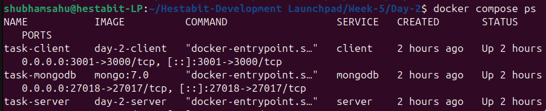
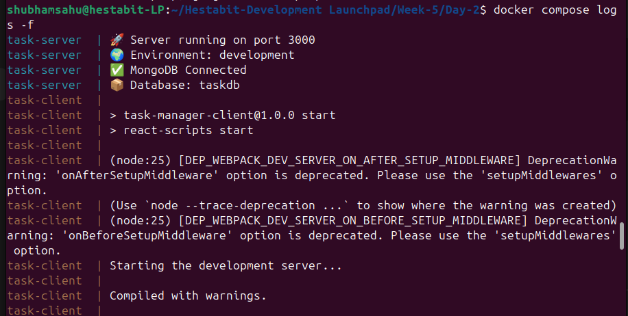
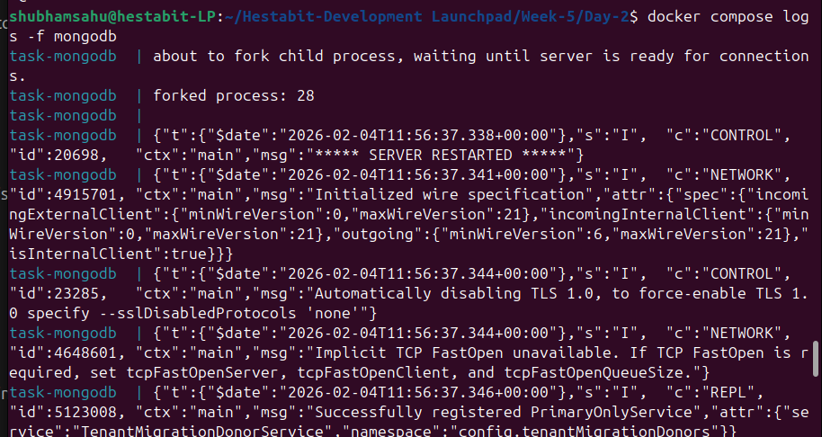
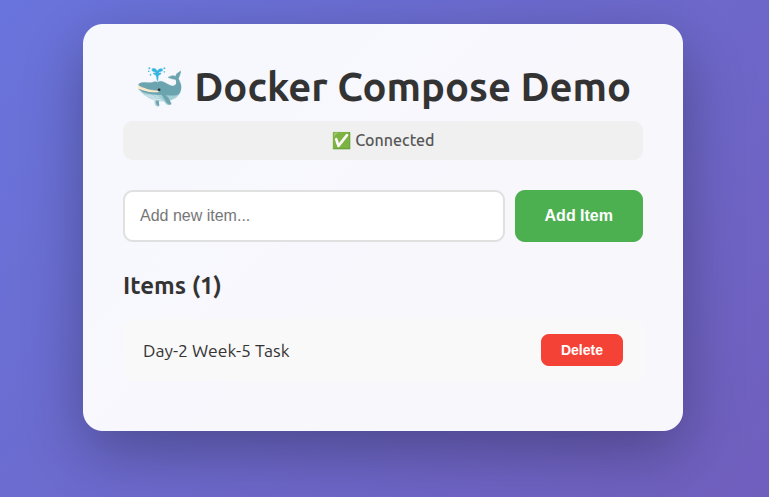
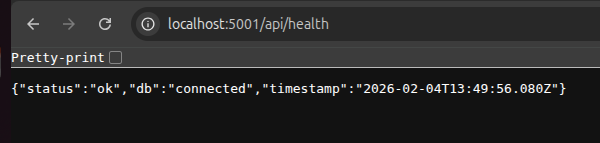
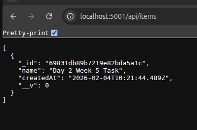

# DAY 2 — Docker Compose & Multi-Container Applications

## Objective
The objective of Day 2 was to learn how **Docker Compose** simplifies running and managing
**multiple interdependent containers** using a single configuration file and a single command.

This day focused on:
- Container-to-container networking
- Persistent storage using volumes
- Centralized service orchestration
- Observing and debugging logs in a containerized environment

Reference:
- Docker Compose official documentation:  
  https://docs.docker.com/compose/

---

## What is Docker Compose (Theory)
Docker Compose is a tool that allows you to:
- Define multiple services (frontend, backend, database) in one YAML file
- Automatically create a shared network
- Manage startup order and dependencies
- Run the entire stack using **one command**

Instead of manually running:
```bash
docker run ...
docker network create ...
docker volume create ...
```

Docker Compose handles everything declaratively.

---

## Application Stack
This project consists of:

- **Client** → React frontend
- **Server** → Node.js + Express API
- **Database** → MongoDB

Each runs in its own container but communicates through Docker’s internal bridge network.

---

## Architecture Diagram

```
Browser
   ↓
React Client (task-client)
   ↓ HTTP (port 5001)
Node Server (task-server)
   ↓ Mongoose
MongoDB (task-mongodb)
```

---

## Docker Networking (Important Concept)
- Docker Compose creates a **default bridge network**
- Each service is reachable using its **service name**
- `localhost` is never used between containers

Example:
```env
MONGO_URI=mongodb://mongodb:27017/taskdb
```

Here `mongodb` is the service name defined in `docker-compose.yml`.

---

## Volumes (Persistent Storage)
MongoDB uses a named volume:

- Data persists even if the container restarts
- Prevents data loss during development
- Volume is removed only with `docker compose down -v`

---

## Logging in Containers
Containers do not use `/var/log`.

Instead:
- Logs are written to `stdout` and `stderr`
- Docker captures and exposes logs

Command used:
```bash
docker compose logs server
```

This is the **standard logging approach in containers**.

---

## Commands Used

### Start all services
```bash
docker compose up -d
```

### Check running containers
```bash
docker compose ps
```

### View logs
```bash
docker compose logs server
docker compose logs client
docker compose logs mongodb
```

### Stop services
```bash
docker compose down
```

### Stop services and remove volumes
```bash
docker compose down -v
```

### Rebuild images after code changes
```bash
docker compose up --build -d
```

---

## Health Check Verification
Backend exposes:
```
GET /api/health
```

Used to verify:
- Server availability
- MongoDB connection status
- Runtime timestamp

---

## Screenshots (Followed Markdown Convention)

### Running Containers


### Server Logs (Mongo Connected)


### MongoDB Logs


### React App Running


### Health API Response


### Item Added


---

## Final Outcome
- Full-stack app deployed using **one command**
- Backend successfully connected to MongoDB via container networking
- Logs verified using Docker
- Database persistence confirmed via volumes

---
