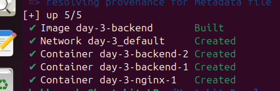
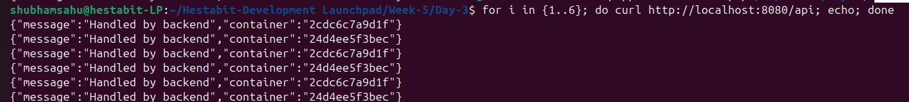
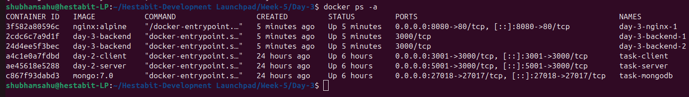

# Day 3 — NGINX Reverse Proxy + Load Balancing

## Objective
Set up NGINX inside Docker as a reverse proxy and route `/api` requests
to multiple backend containers using round-robin load balancing.

---

## Project Structure

```
Day-3/
├── docker-compose.yml
├── reverse-proxy-readme.md
├── screenshots/
│   ├── round-robin.png
│   ├── containers-running.png
│   └── docker-ps.png
├── nginx/
│   └── nginx.conf
└── backend/
    ├── Dockerfile
    ├── index.js
    └── package.json
```

---

## Step-by-Step Setup

### Step 1: Create backend application
```bash
mkdir backend
cd backend
npm init -y
npm install express
```

The backend runs on port `3000` and returns its container hostname to
identify which instance handled the request.

---

### Step 2: Dockerize backend
- Created a Dockerfile for the backend
- Exposed port `3000` internally
- Same backend image used for multiple containers

---

### Step 3: Configure NGINX as reverse proxy
- Created `nginx.conf`
- Routed `/api` requests to `backend:3000`
- Default round-robin load balancing enabled

---

### Step 4: Docker Compose setup
- One NGINX service
- One backend service
- Backend accessible only inside Docker network
- NGINX exposed on host port `8080`

---

### Step 5: Start services with two backend instances
```bash
docker compose up -d --build --scale backend=2
```

---

### Step 6: Verify running containers
```bash
docker ps -a
```



---

### Step 7: Test API routing via NGINX
```bash
curl http://localhost:8080/api
```

---

### Step 8: Verify round-robin load balancing
```bash
for i in {1..6}; do curl http://localhost:8080/api; echo; done
```

Different container IDs in responses confirm that requests are being
distributed across backend instances.



---

## Docker Status Verification

```bash
docker ps -a
```



---

## Key Learnings
- NGINX can act as a reverse proxy inside Docker
- Multiple backend containers can run on the same internal port
- Docker service names resolve to multiple container IPs
- NGINX performs round-robin load balancing by default

---

## Outcome
✔ NGINX reverse proxy running inside Docker  
✔ Internal container routing configured  
✔ Two backend instances running on the same port  
✔ Round-robin load balancing verified with screenshots  