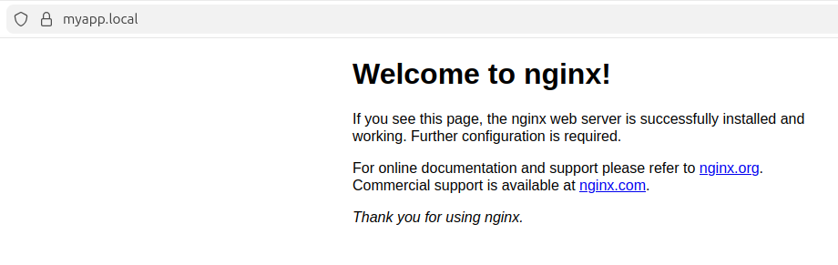

***

```markdown
# SSL Setup Documentation - Local Development

This document describes the process of setting up a locally trusted SSL certificate for the domain `myapp.local` using Docker and Nginx.

## 1. Prerequisites
- **OS:** Ubuntu (Linux)
- **Tool:** `mkcert` (For generating locally-trusted certificates)
- **Environment:** Docker & Docker Compose
- **Web Server:** Nginx (Containerized)

## 2. Installation & CA Setup
To ensure the browser trusts the local certificates, the `mkcert` Root CA was installed on the system:

```bash
# Install dependencies
sudo apt update && sudo apt install libnss3-tools -y

# Install mkcert CA
mkcert -install
```

## 3. Hostname Mapping
The local domain was mapped to the loopback address in the host machine's `/etc/hosts` file:

```bash
# Added to /etc/hosts
127.0.0.1   myapp.local
```

## 4. Certificate Generation
Generated the certificate and private key specifically for `myapp.local` and organized them into the `certs/` directory:

```bash
# Generated using mkcert
mkcert myapp.local
```
**Files generated and moved to `/certs`:**
- `certs/myapp.local.pem` (Certificate)
- `certs/myapp.local-key.pem` (Private Key)

*(Note: The `ssl/` folder contains standard `server.crt` and `server.key` aliases for internal Docker mapping.)*

## 5. Docker & Nginx Configuration
The setup uses **Docker Compose** to mount the certificates into the Nginx container.

### Docker Compose Snippet (`docker-compose.yml`):
```yaml
services:
  web:
    image: nginx:latest
    ports:
      - "443:443"
    volumes:
      - ./nginx:/etc/nginx/conf.d
      - ./certs:/etc/nginx/ssl
```

### Nginx Configuration Snippet:
```nginx
server {
    listen 443 ssl;
    server_name myapp.local;

    ssl_certificate /etc/nginx/ssl/myapp.local.pem;
    ssl_certificate_key /etc/nginx/ssl/myapp.local-key.pem;

    location / {
        root /usr/share/nginx/html;
        index index.html;
    }
}
```

## 6. Verification
### A. OpenSSL Handshake
Verified the handshake via terminal:
```bash
openssl s_client -showcerts -connect myapp.local:443
```
**Result:** `Verification: OK`

### B. Browser Verification
Accessed `https://myapp.local`. The connection is secure and the certificate is trusted.

## 7. Visual Proof
Below are the screenshots showing the transition from HTTP to a secured HTTPS connection.

### HTTP (Insecure) Connection


### HTTPS (Secure) Connection


## 8. Final Directory Structure
```text
Day-4/
├── certs/                      # mkcert generated files
│   ├── myapp.local-key.pem
│   └── myapp.local.pem
├── ssl/                        # Standardized cert aliases
│   ├── server.crt
│   └── server.key
├── nginx/                      # Nginx configuration files
├── screenshots/                # Verification images
│   ├── http_working.png
│   └── https_working.png
├── docker-compose.yml          # Docker orchestration
├── ssl-setup.md                # Documentation (this file)
└── README.md                   # Project Overview
```

---
*Created by: Shubham Sahu*
```

***

### Final Checklist before pushing:
1.  **Redundancy check**: Ensure `server.crt` and `server.key` inside your `ssl/` folder are actually copies of your `myapp.local.pem` and `myapp.local-key.pem`.
2.  **Screenshots**: Ensure your `http_working.png` and `https_working.png` are inside the `screenshots/` folder.
3.  **Git Status**: Your screenshot shows "U" (Untracked) next to your files in VS Code. Don't forget to:
    ```bash
    git add .
    git commit -m "Complete Day 4 SSL setup with Docker and mkcert"
    git push origin <your-branch>
    ```