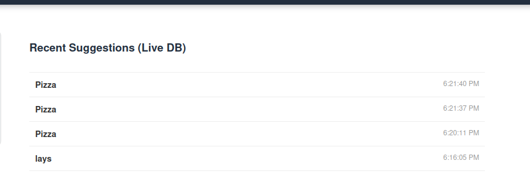
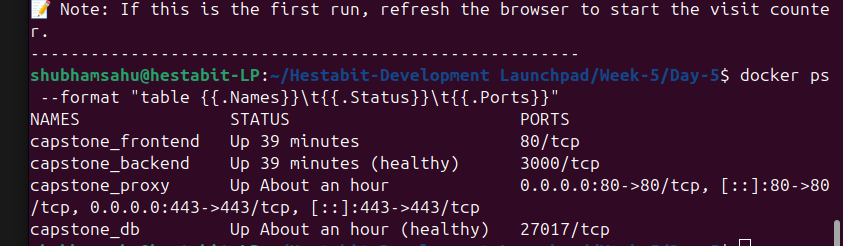
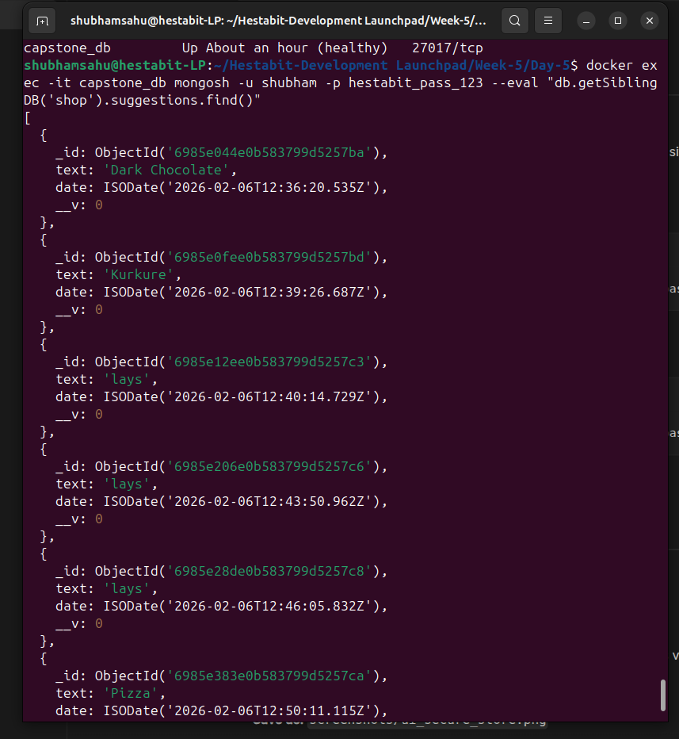

***

```markdown
# Production Deployment Guide - Week 5 Capstone

This document provides a comprehensive guide to the architecture, deployment, and verification of the Secure E-Commerce Full-Stack application.

## 1. Project Overview
The objective of this project was to deploy a production-simulated environment locally using Docker, Nginx, and MongoDB. The application provides a product storefront that interacts with a persistent database via a secure HTTPS connection.

### Core Stack:
- **Frontend**: Nginx/Alpine serving an interactive storefront (HTML5/CSS3/Vanilla JS).
- **Backend**: Node.js & Express API acting as the bridge between the UI and MongoDB.
- **Database**: MongoDB (NoSQL) for persistent storage of user suggestions and site analytics.
- **Reverse Proxy**: Nginx handling SSL/TLS termination and request routing.

## 2. Prerequisites & Setup
Before running the deployment, ensure the host machine is configured:

1. **Local Domain Mapping**: 
   Add the following to your `/etc/hosts` file:
   ```text
   127.0.0.1   myapp.local
   ```
2. **SSL Trust**:
   Ensure `mkcert` is installed and the CA is trusted:
   ```bash
   mkcert -install
   ```
3. **Secrets**:
   Create a `.env` file based on `.env.example` with your MongoDB credentials.

## 3. Production Checklist Implementation
As per the project requirements, the following "Production-Grade" features have been implemented:

- [x] **docker-compose.prod.yml**: A dedicated production configuration file.
- [x] **Compose Profiles**: Used the `fullstack` profile to manage the entire service group.
- [x] **Secrets Management**: Sensitive DB credentials stored in `.env`.
- [x] **Healthchecks**: 
    - MongoDB: Uses `mongosh` ping test.
    - Backend: Uses `wget` to verify the `/health` endpoint.
    - Proxy: Depends on Backend `service_healthy` status.
- [x] **Log Rotation**: Configured via `json-file` driver (Max 10MB, 3 rotations).
- [x] **Container Restart Policy**: Set to `always` or `unless-stopped`.
- [x] **Docker Volumes**: Named volume `mongo_data` used to persist database state.

## 4. Deployment Instructions
The deployment is fully automated via a shell script.

```bash
# Navigate to project root
cd ~/Hestabit-Development-Launchpad/Week-5/Day-5

# Execute deployment automation
chmod +x scripts/deploy.sh
./scripts/deploy.sh
```

## 5. Verification & Testing
### A. Browser Verification
1. Access `https://myapp.local`.
2. **HTTPS Check**: Verify the SSL lock icon.
3. **Full-Stack Logic**: Refresh the page to see the **"Database Visits"** increment. Submit a suggestion to see it persist in the list.

## 6. Visual Proof (Screenshots)

### Secure Storefront & SSL Verification


### Live Database Interaction (Wishlist)


### Container Health Status


### MongoDB Query Proof


## 7. Project Directory Structure
```text
Day-5/
├── apps/
│   ├── backend/         # Express API & Dockerfile
│   └── frontend/        # UI Assets & Dockerfile
├── nginx/
│   ├── default.conf     # Proxy & SSL Configuration
│   └── ssl/             # mkcert Certificate storage
├── scripts/
│   └── deploy.sh        # Deployment script
├── screenshots/         # Verification images
├── .env                 # Secret environment variables
├── docker-compose.prod.yml
└── production-guide.md
```

## 8. Major Command Reference Library
Below are the primary commands utilized during the development and maintenance of this project.

### Environment & SSL Setup
```bash
# Update hosts file
echo "127.0.0.1 myapp.local" | sudo tee -a /etc/hosts

# Install local Root CA
mkcert -install
```

### Deployment & Lifecycle
```bash
# Deploy the full stack using profiles
docker compose -f docker-compose.prod.yml --profile fullstack up -d --build

# Stop the stack and remove orphans
docker compose -f docker-compose.prod.yml down --remove-orphans

# View real-time logs for the proxy
docker logs -f capstone_proxy
```

### Database Verification
```bash
# Check stored suggestions in MongoDB
docker exec -it capstone_db mongosh -u shubham -p hestabit_pass_123 --eval "db.getSiblingDB('shop').suggestions.find().pretty()"

# Check persistent visit counter
docker exec -it capstone_db mongosh -u shubham -p hestabit_pass_123 --eval "db.getSiblingDB('shop').stats.find()"
```

### Network & Connectivity Debugging
```bash
# Check if ports 80/443 are listening on the host
sudo lsof -i :443
sudo ss -tulpn | grep :443

# Test HTTPS handshake via terminal
curl -v -k https://myapp.local
openssl s_client -connect myapp.local:443 -brief
```

### Cleanup
```bash
# Remove unused Docker images (Pruning)
docker image prune -f

# Hard reset of all project containers
docker rm -f capstone_db capstone_backend capstone_frontend capstone_proxy
```

---

```