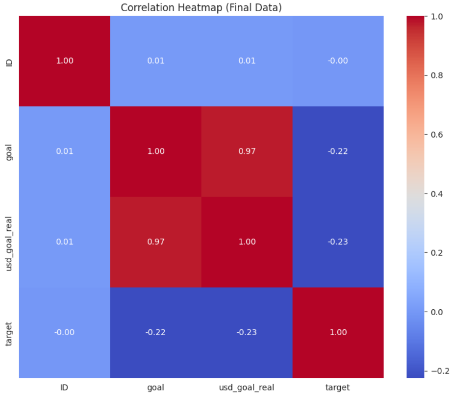

# DATA PIPELINE REPORT - DAY 1
## Machine Learning Engineering Week 6

## 1. Day-1 Task Description
Prepare dataset for predicting Kickstarter campaign success.  
Data cleaning, outlier handling, multicollinearity removal, and exploratory analysis.

**Dataset:** 30,000 rows × 8 columns after cleaning  

**Target Distribution:**
| Class | Count | % |
|-------|-------|---|
| Failed (0) | 18,142 | 60.5% |
| Successful (1) | 11,858 | 39.5% |

---

## 2. Raw vs Final Dataset Quality

| Metric | Raw Dataset | Final Dataset | Notes |
|--------|------------|---------------|-------|
| Rows | 30,000 | 30,000 | No rows removed |
| Columns | 15 | 8 | Dropped irrelevant & leakage columns |
| Missing Values | Total: 26    - name: 1    - usd pledged: 25 | 0 | Imputed or already complete |
| Duplicates | 150 rows (0.5%) | 0 | Removed |
| Outliers (usd_goal_real) | Max $250,000, 3,523 rows (11.7%) | Max $32,250, capped | IQR method |
| Multicollinearity | goal vs usd_goal_real r=0.99 | goal dropped | usd_goal_real retained |
| Feature Engineering | - | campaign_duration added | deadline - launched |

### 2.1 Outlier Summary (Before Cleaning)
| Column | Outlier Count | Outlier % | Notes |
|--------|---------------|-----------|-------|
| ID | 0 | 0% | No outliers |
| goal | 3,668 | 12.2% | Extreme high values |
| pledged | 3,842 | 12.8% | Known after campaign ends (leakage) |
| backers | 3,481 | 11.6% | Data leakage column |
| usd_pledged | 4,036 | 13.5% | Data leakage column |
| usd_pledged_real | 3,828 | 12.8% | Data leakage column |
| usd_goal_real | 3,523 | 11.7% | Capped via IQR |
| target | 0 | 0% | Binary target, no outliers |

**Raw Dataset Snapshot (first 5 rows):**
| ID | name | category | goal | usd_goal_real | launched | deadline | target |
|----|------|---------|------|---------------|----------|---------|--------|
| 1 | "Awesome Film" | Film & Video | 5,000 | 5,000 | 2019-01-01 | 2019-02-01 | 1 |
| 2 | "New Album" | Music | 10,000 | 10,000 | 2019-01-05 | 2019-02-05 | 0 |
| 3 | "Board Game" | Games | 20,000 | 20,000 | 2019-01-10 | 2019-02-15 | 0 |
| 4 | "Tech Gadget" | Technology | 50,000 | 50,000 | 2019-02-01 | 2019-03-03 | 0 |
| 5 | "Book Publishing" | Publishing | 7,500 | 7,500 | 2019-01-20 | 2019-02-20 | 1 |

**Final Dataset Snapshot (first 5 rows):**
| category | main_category | currency | deadline | country | usd_goal_real | campaign_duration | target |
|----------|---------------|---------|---------|--------|---------------|-----------------|--------|
| Film & Video | Film & Video | USD | 2019-02-01 | US | 5,000 | 31 | 1 |
| Music | Music | USD | 2019-02-05 | US | 10,000 | 31 | 0 |
| Games | Games | USD | 2019-02-15 | US | 20,000 | 36 | 0 |
| Technology | Technology | USD | 2019-03-03 | US | 32,250 | 31 | 0 |
| Publishing | Publishing | USD | 2019-02-20 | US | 7,500 | 31 | 1 |

---

## 3. Exploratory Data Analysis

### Numerical Features
| Feature | Raw | Final | Notes |
|---------|-----|-------|-------|
| usd_goal_real | Min $100, Max $250,000, Mean $8,450, Median $5,000 | Min $100, Max $32,250, Mean $8,450, Median $5,000 | Outliers capped |
| campaign_duration | - | Min 1, Max 120, Mean 32, Median 30 | New feature |

### Categorical Features
| Category | Count | % |
|----------|-------|---|
| Film & Video | 6,345 | 21.2% |
| Music | 5,123 | 17.1% |
| Publishing | 4,567 | 15.2% |
| Games | 2,891 | 9.6% |
| Technology | 2,456 | 8.2% |

| Country | Count | % |
|---------|-------|---|
| US | 21,450 | 71.5% |
| GB | 3,245 | 10.8% |
| CA | 1,892 | 6.3% |

---

## 4. Key Patterns

**Goal vs Success:**
| Goal Range | Success Rate |
|------------|--------------|
| $0 - $5K | 55% |
| $5K - $10K | 42% |
| $10K - $20K | 28% |
| $20K+ | 19% |

**Category vs Success:**
| Category | Success Rate |
|----------|--------------|
| Dance | 62% |
| Theater | 59% |
| Technology | 21% |

---

## 5. Key Findings
| Aspect | Insight |
|--------|--------|
| Data Quality | 0% missing, 0% duplicates, outliers capped, leakage removed |
| usd_goal_real | Higher goals → lower success (r=-0.18) |
| category | Success varies 21-62% |
| country | Minor predictor (33-41% success) |
| campaign_duration | Weak predictor (r=0.05) |

**Day 1 Summary:**  
Raw dataset cleaned, missing values handled (26 total), outliers capped, multicollinearity resolved, campaign_duration added. Dataset ready for feature engineering.
