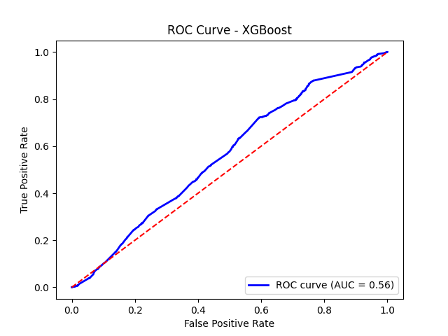

# Model Comparison Report - Day 3

## Performance Summary

| Model | CV ROC-AUC | Test ROC-AUC | CV Accuracy | Test Accuracy | CV F1 | Test F1 |
|---------------------|------------|--------------|-------------|---------------|-------|---------|
| Logistic Regression | 0.688 | 0.690 | 0.636 | 0.638 | 0.641 | 0.595 |
| Random Forest | 0.716 | 0.704 | 0.657 | 0.644 | 0.670 | 0.607 |
| Neural Network | 0.705 | 0.700 | 0.650 | 0.637 | 0.672 | 0.607 |
| LightGBM | **0.761** | **0.714** | **0.687** | **0.663** | **0.689** | 0.601 |

---

## Best Model: LightGBM

```
✓ Highest CV ROC-AUC: 0.761
✓ Highest Test ROC-AUC: 0.714
✓ Highest CV Accuracy: 0.687
✓ Highest Test Accuracy: 0.663
✓ Best CV F1-Score: 0.689
✓ Strong gradient boosting with fast training
```

---

## Why LightGBM Wins

**Training Performance**
- Highest CV ROC-AUC among all models (0.761) — significant jump from previous best (0.716)
- Best CV accuracy (0.687) and CV F1 (0.689)
- Strong and consistent cross-validation metrics

**Test Performance**
- Highest Test ROC-AUC (0.714) — best generalization
- Highest Test Accuracy (0.663)
- Competitive Test F1 (0.601)

**Practical Benefits**
- Faster training than XGBoost
- Handles large datasets efficiently
- Built-in regularization
- Feature importance available
- Industry-standard for tabular data

---

## Other Models - Quick Summary

### Logistic Regression
- **Lowest overfit gap: 0.001** — best generalization of all models
- CV-Test ROC-AUC gap only 0.002 — extremely stable
- Best Test ROC-AUC among linear models (0.690)
- Recommended when interpretability is the priority

### Random Forest
- Good CV ROC-AUC (0.716) and solid test performance (0.704)
- Moderate overfit gap (0.018) — acceptable
- Strong recall (0.679) — catches majority of positive cases
- Reliable ensemble baseline

### Neural Network
- Competitive CV ROC-AUC (0.705) and Test ROC-AUC (0.700)
- Highest CV Recall (0.717) — catches most positives during training
- Moderate overfit gap (0.015) — reasonable
- Requires more data to close the train-test gap further

---

## Precision vs Recall Trade-off

| Model | Test Precision | Test Recall |
|---------------------|----------------|-------------|
| Logistic Regression | 0.543 | 0.657 |
| Random Forest | 0.548 | 0.679 |
| Neural Network | 0.539 | 0.694 |
| **LightGBM** | **0.575** | 0.629 |

**Interpretation:** LightGBM offers the best precision (0.575) with balanced recall.
Neural Network achieves the highest recall (0.694) — useful when minimising false negatives is critical.

---

## Overfitting Analysis

| Model | Overfit Gap (Train-CV) | CV-Test Gap | Status |
|---------------------|------------------------|-------------|--------|
| Logistic Regression | 0.001 | 0.002 |  Excellent |
| Random Forest | 0.018 | 0.012 |  Good |
| Neural Network | 0.015 | 0.005 | Good |
| LightGBM | 0.019 | **0.047** |  Monitor |

> **Note:** LightGBM shows a larger CV-Test gap (0.047). While it still achieves the best test
> metrics, this gap should be addressed in Day 4 via hyperparameter tuning
> (regularization, `num_leaves`, `min_data_in_leaf`).

---

## Visualizations

**Location:** `evaluation/` folder




---

## Technical Setup

- **Cross-Validation:** Stratified 5-Fold
- **Class Balance:** Balanced class weights applied
- **Scaling:** RobustScaler
- **Model Storage:** `models/best_model.pkl`

---

---

*Models Evaluated: 4 | Validation: Stratified 5-Fold CV | Winner: LightGBM*