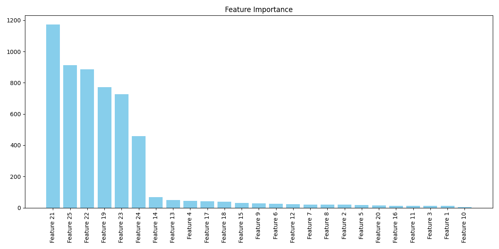
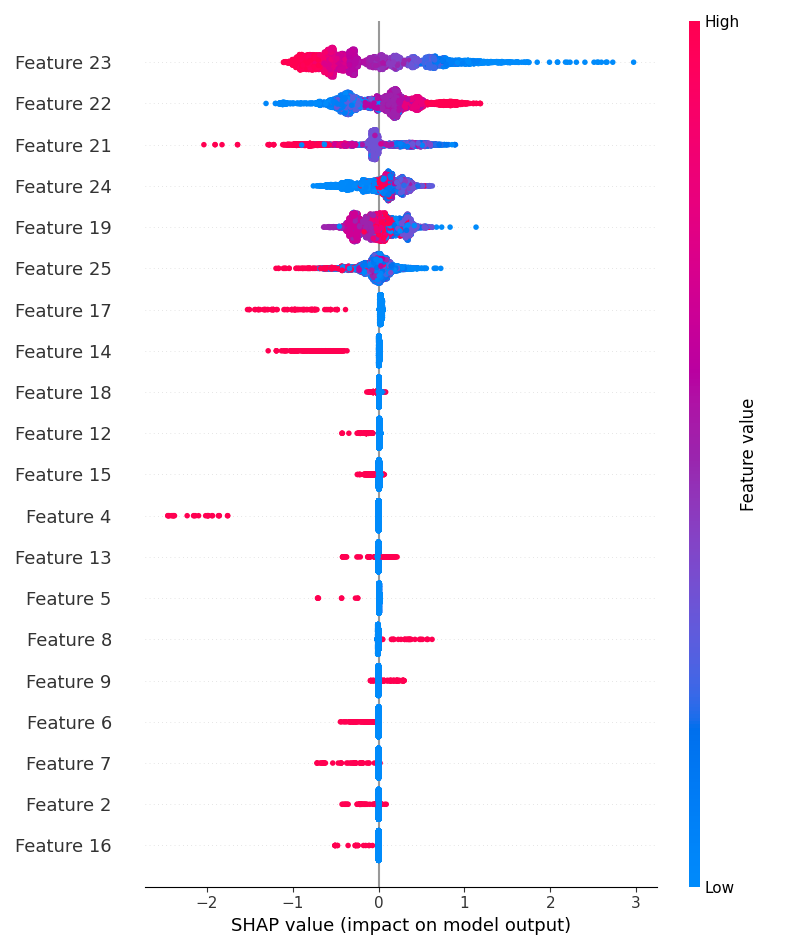

# Model Interpretation Report

This report summarizes the performance, tuning, and interpretation of the **LightGBM model** used for prediction. It includes cross-validation and test metrics, best hyperparameters, and plots for feature importance, SHAP analysis, and error patterns.
For Other Deliverables refer to src folder for the whole code.
---

## 1. Model Performance

The table below shows model performance **before and after hyperparameter tuning**. CV metrics indicate internal validation, while Test metrics measure generalization.

| Metric | CV Before | Test Before | CV After | Test After |
|--------|-----------|------------|----------|-----------|
| Accuracy | 0.687 | 0.663 | 0.697 | 0.660 |
| Precision | 0.685 | 0.575 | 0.703 | 0.578 |
| Recall | 0.693 | 0.629 | 0.683 | 0.584 |
| F1 Score | 0.689 | 0.601 | 0.693 | 0.581 |
| ROC-AUC | 0.761 | 0.714 | 0.774 | 0.709 |
| Overfit Gap | 0.019 | 0.047 | 0.036 | 0.065 |

> **Observation:** Tuning improved CV performance slightly, especially ROC-AUC, while test metrics remain stable.

---

## 2. Best Hyperparameters

These are the **Optuna-tuned parameters** that produced the best CV ROC-AUC:

| Parameter | Value |
|-----------|-------|
| n_estimators | 483 |
| max_depth | 4 |
| learning_rate | 0.093 |
| num_leaves | 70 |
| min_child_samples | 18 |
| subsample | 0.673 |
| colsample_bytree | 0.673 |
| reg_alpha | 0.608 |
| reg_lambda | 1.050 |

---

## 3. Plots

The following visualizations help interpret the model and analyze errors:

| Plot | Description |
|------|------------|
|  | Shows which features most influence predictions.  |
|  | Illustrates feature impact on each prediction. Positive SHAP → higher predicted probability. |
|  | Highlights correlation among mispredicted samples and error clusters. Useful for further feature engineering. |

---

## 4. Key Takeaways

- Hyperparameter tuning improved CV metrics slightly; test performance remains comparable.  
- Error patterns indicate potential feature interactions that could be engineered for better predictions.  
- Overall, the model is moderately robust and interpretable.
