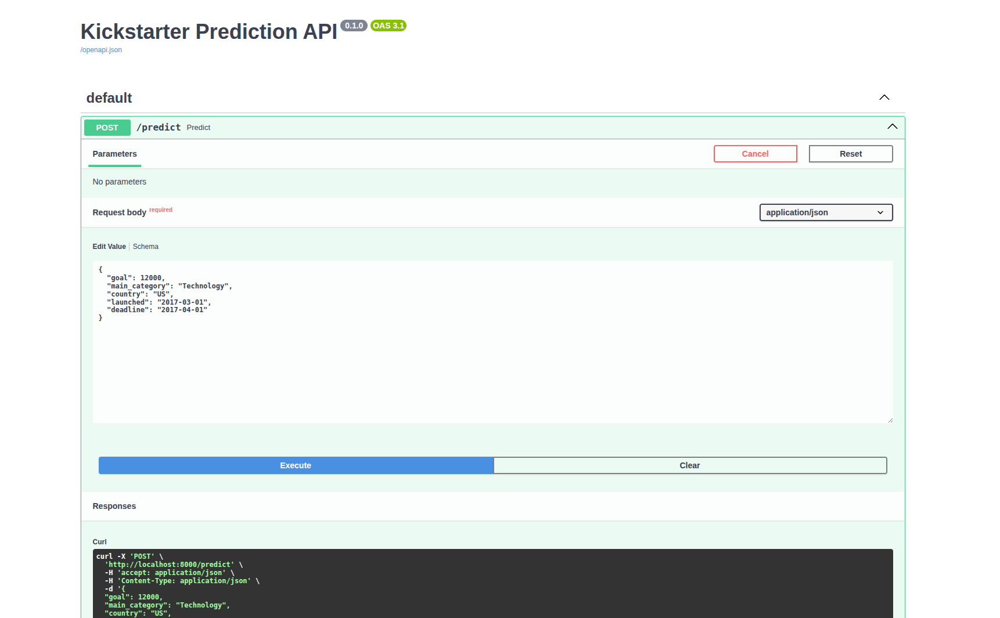
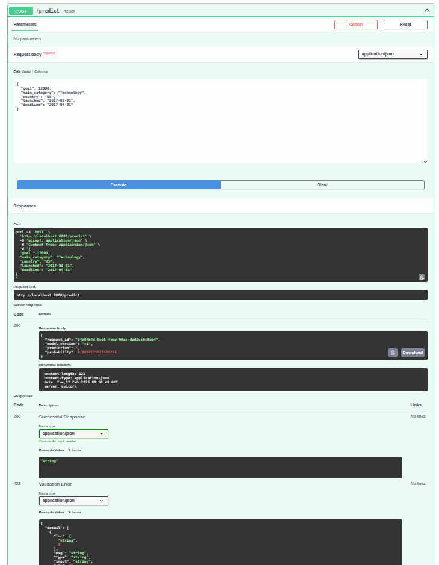
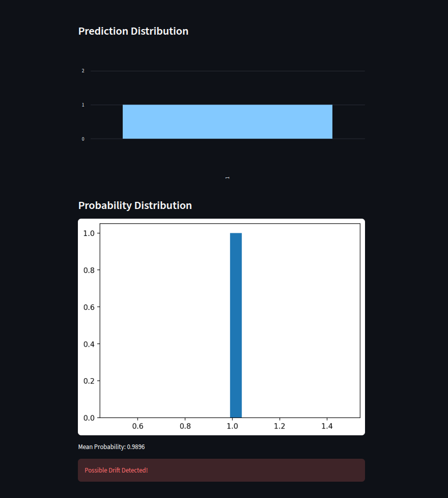
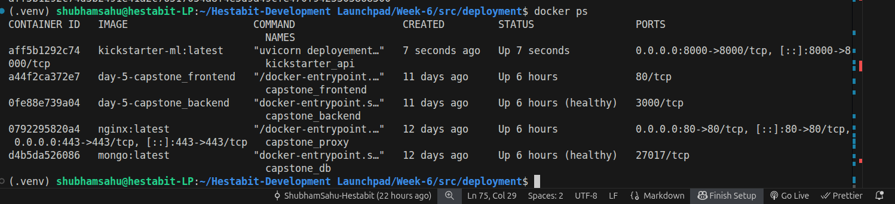

# Day-5 Capstone --- Model Deployment & MLOps Implementation

------------------------------------------------------------------------

# 1. Objective

Deploy a trained ML model into a production-ready system with:

-   API serving
-   Inference wrapper
-   Logging
-   Drift monitoring
-   Dashboard
-   Docker containerization

------------------------------------------------------------------------

# 2. Model Summary

## Algorithm

LightGBM (Gradient Boosted Trees)

## Training Pipeline

-   Feature engineering
-   Correlation filtering
-   Mutual Information selection
-   SMOTE balancing
-   Cross-validation
-   Optuna hyperparameter tuning

## Final Model Artifact

models/best_lgbm_model.pkl

Saved using:

``` python
joblib.dump(best_model, "best_lgbm_model.pkl")
```

------------------------------------------------------------------------
## 3.Artifacts & Inference
import joblib

preprocessor = joblib.load("models/preprocessor.pkl")
scaler = joblib.load("models/scaler.pkl")
model = joblib.load("models/best_lgbm_model.pkl")

X_processed = preprocessor.transform(raw_input)
X_scaled = scaler.transform(X_processed)
prediction = model.predict(X_scaled)
probability = model.predict_proba(X_scaled)[:,1]


------------------------------------------------------------------------

# 4. Alternative Production Approach

File: src/pipelines/inference_pipeline.py
chose a manual wrapper for greater flexibility and control.


File: src/pipelines/inference_pipeline.py

## Why We Built a Wrapper

Training and production environments differ. Directly loading a model
without consistent preprocessing can cause:

-   Feature mismatch
-   Encoding inconsistency
-   Training-serving skew
-   Silent production errors
## What the Wrapper Does

1.  Loads trained model
2.  Accepts raw user input
3.  Applies identical feature engineering logic
4.  Applies scaling/transformations
5.  Returns prediction and probability

This ensures safe and consistent inference.

------------------------------------------------------------------------

# 5. API Layer (FastAPI)

File: src/deployement/api.py

## Endpoint

POST /predict

### Example Input

``` json
{
    "category": "technology",
    "main_category": "Gadgets",
    "currency": "USD",
    "deadline": "2026-12-31",
    "goal": 10000,
    "launched": "2026-11-01",
    "country": "US",
    "usd_goal_real": 10000
}
```

### Response

``` json
{
  "request_id": "97637c49-1c0b-4eaf-b5fa-109703afaa86",
  "model_version": "v1.0",
  "prediction": 1,
  "probability_success": 0.7364
}
```

### Production Features

-   Input validation (Pydantic)
-   Unique Request ID
-   Timestamp tracking
-   Model versioning
-   CSV logging

------------------------------------------------------------------------

# 6. Prediction Logging

File: src/logs/prediction_logs.csv

Logs include: - Timestamp - Request ID - Input features - Prediction -
Probability

Used for monitoring, auditing, and drift detection.

------------------------------------------------------------------------

# 7. Drift Monitoring

File: src/monitoring/drift_checker.py

Functionality: - Reads prediction logs - Checks probability distribution
shift - Alerts if abnormal deviation detected

Run:

``` bash
python src/monitoring/drift_checker.py
```

------------------------------------------------------------------------

# 8. Dashboard (Streamlit)

File: src/dashboard/app.py

Displays: - Total predictions - Class distribution - Probability
histogram - Drift visualization

Run:

``` bash
streamlit run src/dashboard/app.py
```

------------------------------------------------------------------------

# 9. Docker Deployment

## LightGBM System Dependency

LightGBM requires: libgomp.so.1

Installed inside Docker using:

``` dockerfile
RUN apt-get update && apt-get install -y \
    build-essential \
    libgomp1 \
    && rm -rf /var/lib/apt/lists/*
```

------------------------------------------------------------------------

## Dockerfile Location

src/deployement/Dockerfile

## Build Command

``` bash
docker build -t kickstarter-ml -f src/deployement/Dockerfile .
```

## Run Command

``` bash
docker run -d -p 8000:8000 --name kickstarter_api kickstarter-ml
```

Access: http://localhost:8000/docs

------------------------------------------------------------------------

# 10. requirements.txt

    fastapi
    uvicorn
    pydantic
    pandas
    numpy
    scikit-learn
    lightgbm
    joblib
    python-dotenv
    streamlit
    matplotlib
    seaborn
    imblearn
    optuna

------------------------------------------------------------------------

# 11. Order of Execution

## Training Phase

1.  build_features.py
2.  feature_selector.py
3.  train.py
4.  tuning.py

## Deployment Phase (Local)

``` bash
uvicorn deployement.api:app --reload
```

## Docker Phase

``` bash
docker build -t kickstarter-ml -f src/deployement/Dockerfile .
docker run -d -p 8000:8000 --name kickstarter_api kickstarter-ml
```

------------------------------------------------------------------------

# 12. Screenshots

## Swagger UI



## Prediction Response



## Dashboard View



## Docker Running Container



------------------------------------------------------------------------

# 13. Final Conclusion

This capstone demonstrates:

-   End-to-end ML lifecycle
-   Safe inference architecture
-   Production API serving
-   Logging & monitoring
-   Drift detection
-   Docker containerization
-   System dependency handling
-   Real-world ML Engineering practices

