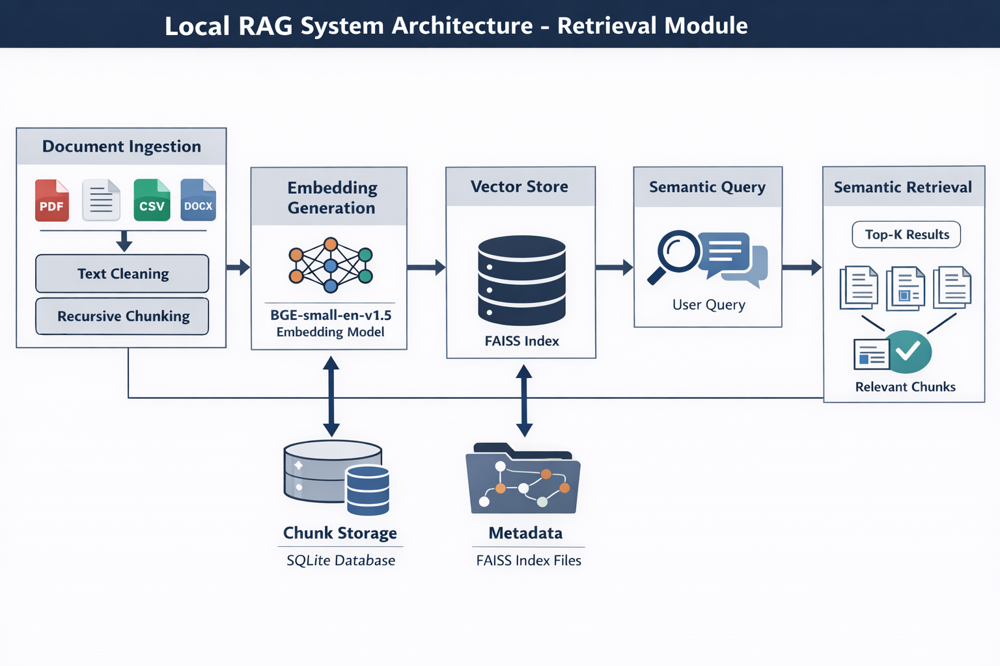

# WEEK 7

# Local RAG System --- Retrieval Foundation

------------------------------------------------------------------------

##  Overview

This project implements the **Day-1 Retrieval Foundation** for an
Enterprise Knowledge Intelligence System.

The system focuses entirely on:

-   Document ingestion
-   Text cleaning
-   Recursive chunking
-   Semantic embeddings (BGE-small)
-   FAISS vector indexing
-   Top-K semantic retrieval
-   Structured chunk persistence (SQLite)

 No LLM generation is included in Day-1.\
This is strictly the retriever architecture.

------------------------------------------------------------------------

# System Architecture



------------------------------------------------------------------------

## Architecture Flow

    Raw Documents
          ↓
    Document Loader (PDF / CSV / TXT / DOCX)
          ↓
    Text Cleaning
          ↓
    Recursive Chunking (800 size / 100 overlap)
          ↓
    Embedding Generation (BGE-small)
          ↓
    FAISS Vector Index (Flat)
          ↓
    Query Embedding (BGE-small)
          ↓
    Top-K Relevant Chunks

------------------------------------------------------------------------
1.Document Ingestion
The system loads documents from multiple formats (PDF, CSV, TXT, DOCX) using structured loaders.
This ensures flexibility and extensibility for enterprise knowledge sources.

2.Text Cleaning
Basic normalization is applied (whitespace trimming, spacing normalization) to reduce embedding noise and improve retrieval accuracy.

3.Recursive Chunking
Documents are split into semantic chunks (800 characters with 100 overlap).
This preserves contextual continuity while ensuring manageable embedding sizes.

4.Embedding Generation
Each chunk is converted into a dense semantic vector using BGE-small-en-v1.5.
These embeddings capture contextual meaning beyond keyword matching.

5.Vector Indexing (FAISS)
All embeddings are stored in a FAISS Flat index for efficient similarity search.
This enables fast nearest-neighbor retrieval even for large datasets.

6.Query Embedding
User queries are embedded using the same embedding model to maintain semantic alignment.

7.Semantic Retrieval (Top-K)
FAISS performs similarity search and returns the most relevant chunks along with similarity scores and metadata.

# Tech Stack

  Component       Technology                       Purpose
  --------------- -------------------------------- --------------------------------
  Framework       LangChain                        Modular ingestion & embeddings
  Embeddings      BGE-small-en-v1.5                Lightweight semantic search
  Vector Store    FAISS (Flat Index)               Fast similarity search
  Chunk Storage   SQLite                           Structured persistence
  Chunking        RecursiveCharacterTextSplitter   Stable baseline chunking

------------------------------------------------------------------------

#  Project Structure

    week7-genai/
    │
    ├── .venv/
    ├── requirements.txt
    ├── README.md
    ├── RAG-ARCHITECTURE.md
    │
    └── src/
        ├── data/
        │   ├── raw/
        │   ├── cleaned/
        │   └── chunks/
        ├── embeddings/
        │   └── embedder.py
        ├── pipelines/
        │   └── ingest.py
        ├── retriever/
        │   └── query_engine.py
        ├── vectorstore/
        ├── config/
        └── logs/

------------------------------------------------------------------------

# Setup Instructions

## Create Virtual Environment

``` bash
python3 -m venv .venv
source .venv/bin/activate
```

## Install Dependencies

``` bash
pip install -r requirements.txt
```

------------------------------------------------------------------------

# Run Ingestion Pipeline

Place your document inside:

    src/data/raw/

Run:

``` bash
python src/pipelines/ingest.py
```

This will:

-   Load documents
-   Clean text
-   Create chunks
-   Save chunks in SQLite
-   Generate embeddings
-   Create FAISS index

Generated files:

    src/vectorstore/index.faiss
    src/vectorstore/index.pkl
    src/data/chunks/chunks.db

------------------------------------------------------------------------

# Run Semantic Retrieval

``` bash
python src/retriever/query_engine.py
```

------------------------------------------------------------------------

# Retrieval Output Screenshot


Each result includes:

-   Similarity score
-   Metadata (source, page, chunk_id)
-   Chunk preview

------------------------------------------------------------------------

# Metadata Design

Each chunk contains:

-   `chunk_id`
-   `source`
-   `page`
-   `ingested_at`

This ensures:

-   Traceability
-   Filtering capability
-   Deduplication
-   Enterprise audit readiness

------------------------------------------------------------------------

# Design Decisions

### Why BGE-small?

-   CPU-friendly
-   Strong semantic representation
-   Efficient for local RAG systems

### Why FAISS?

-   High-performance similarity search
-   Fully offline
-   Industry-grade ANN engine

### Why Recursive Chunking?

-   Preserves semantic boundaries
-   Stable baseline approach
-   Easy to evaluate and extend

### Why SQLite?

-   Structured storage
-   Queryable metadata
-   Enterprise-aligned persistence


