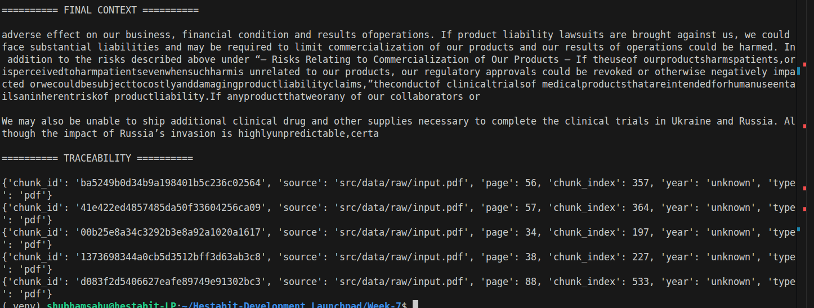

# RETRIEVAL-STRATEGIES.md

## WEEK 7 --- DAY 2

# Advanced Retrieval + Context Engineering

------------------------------------------------------------------------

## Overview

Day-2 focuses on improving retrieval precision and reducing
hallucination by implementing advanced retrieval strategies on top of
the Day-1 semantic retriever.

------------------------------------------------------------------------

# Retrieval Architecture (Day-2)

User Query\
↓\
Semantic Search (FAISS)\
+\
Keyword Search (BM25)\
↓\
Score Fusion\
↓\
Metadata Filtering\
↓\
Deduplication\
↓\
Max Marginal Relevance (MMR)\
↓\
Cross-Encoder Reranking\
↓\
Context Window Optimization\
↓\
Traceable Context Output

------------------------------------------------------------------------

# 🔍 Implemented Strategies

## 1. Hybrid Retrieval (Semantic + Keyword)

### Why?

Pure semantic search sometimes misses exact keyword matches. Pure
keyword search lacks contextual understanding.

### Implementation:

-   FAISS (BGE-small embeddings) for semantic similarity
-   BM25 for keyword-based retrieval
-   Weighted score fusion (alpha blending)

### Benefit:

✔ Higher precision\
✔ Better recall\
✔ Balanced semantic + lexical matching

------------------------------------------------------------------------

## 2. Score Fusion

Both dense and sparse retrieval scores are normalized and combined:

Final Score = α \* Dense + (1 - α) \* Sparse

Default: α = 0.6

This allows controlled balance between semantic and keyword influence.

------------------------------------------------------------------------

## 3.Metadata Filtering

Supported filters: - year - type

Example:

``` python
filters = {"type": "pdf"}
```

Filtering ensures enterprise-grade document routing and access control.

Benefit: ✔ Scoped retrieval\
✔ Controlled domain search\
✔ Audit-friendly architecture

------------------------------------------------------------------------

## 4. Chunk Deduplication

Removes overlapping or repetitive chunks before final selection.

Benefit: ✔ Cleaner context\
✔ Reduced redundancy\
✔ Better token efficiency

------------------------------------------------------------------------

## 5.Max Marginal Relevance (MMR)

Ensures diversity in selected chunks.

Formula balances: - Relevance - Diversity

Benefit: ✔ Prevents similar chunks from dominating\
✔ Improves information coverage

------------------------------------------------------------------------

## 6.Cross-Encoder Reranking

Model Used: cross-encoder/ms-marco-MiniLM-L-6-v2

Process: - Takes query + chunk pairs - Re-scores them jointly - Reorders
results by true relevance

Benefit: ✔ Higher precision\
✔ Reduced hallucination risk\
✔ Context better aligned with query

------------------------------------------------------------------------

## 7.Context Window Optimization

Limits total token size before passing to LLM.

Benefit: ✔ Efficient LLM usage\
✔ Reduced token overflow\
✔ Controlled cost

------------------------------------------------------------------------

## 8.Traceable Context Sources

Each retrieved chunk includes:

-   chunk_id
-   source
-   page
-   chunk_index
-   year
-   type

Example trace output:

``` json
{
  "chunk_id": "...",
  "source": "src/data/raw/input.pdf",
  "page": 56,
  "chunk_index": 357,
  "year": "unknown",
  "type": "pdf"
}
```

Benefit: ✔ Enterprise audit traceability\
✔ Source verification\
✔ Reproducibility

------------------------------------------------------------------------

# Output Screenshot (Day-2)

Below is the output of the advanced retrieval system:



------------------------------------------------------------------------

# Improvements Over Day-1

  Feature                   Day-1      Day-2
  ------------------------- ---------- ----------
  Semantic Search           ✅         ✅
  Keyword Search            ❌         ✅
  Reranking                 ❌         ✅
  Deduplication             ❌         ✅
  MMR                       ❌         ✅
  Metadata Filtering        ❌         ✅
  Traceable Context         Basic      Advanced
  Hallucination Reduction   Moderate   Strong

------------------------------------------------------------------------
