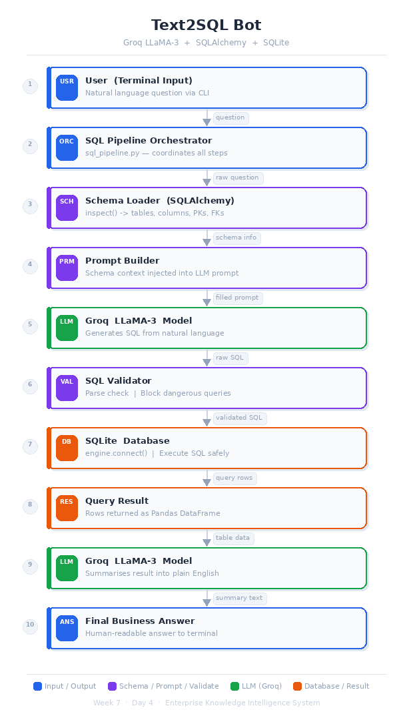

# Day-4: Text-to-SQL Question Answering System

## Objective

Build a Natural Language to SQL system that: - Converts user questions
into SQL queries - Validates queries safely - Executes against SQLite
database - Summarizes results into business insights

------------------------------------------------------------------------

## Architecture Overview

User Question → Schema Extraction → SQL Generation (Groq LLaMA-3) →
Validation → Execution → Result Summarization


------------------------------------------------------------------------

## Model Used

-   Provider: Groq
-   Model: llama-3.1-70b-versatile
-   Temperature: 0 (SQL generation)
-   Temperature: 0.3 (Summarization)

------------------------------------------------------------------------

## Database

-   Engine: SQLite
-   ORM: SQLAlchemy
-   Table: `products`
-   Data Source: CSV file

------------------------------------------------------------------------

## Safety Features

-   SELECT-only enforcement
-   Blocks INSERT / UPDATE / DELETE / DROP / ALTER
-   Prevents multi-statement execution
-   SQLAlchemy execution for safe query handling

------------------------------------------------------------------------

## Example Queries & Outputs

### 1️⃣ Show top 5 most expensive products

**Generated SQL:**

``` sql
SELECT Name, Price FROM products ORDER BY Price DESC LIMIT 5;
```

**Business Insight:** High-end products dominate pricing strategy with
premium offerings, indicating a focus on higher-value inventory
segments.

------------------------------------------------------------------------

### 2️⃣ What is the average price by category?

**Generated SQL:**

``` sql
SELECT Category, AVG(Price) FROM products GROUP BY Category;
```

**Insight:** Clothing & Apparel shows the highest average price,
suggesting premium positioning in that category.

------------------------------------------------------------------------

### 3️⃣ Count products by brand

**Generated SQL:**

``` sql
SELECT Brand, COUNT(*) FROM products GROUP BY Brand;
```

**Insight:** Brand diversity indicates a competitive supplier ecosystem
with distributed inventory presence.

------------------------------------------------------------------------

### 4️⃣ Which category has the highest average price?

**Generated SQL:**

``` sql
SELECT Category, AVG(Price)
FROM products
GROUP BY Category
ORDER BY AVG(Price) DESC
LIMIT 1;
```

**Insight:** Clothing & Apparel leads the premium pricing segment based
on average product price.

------------------------------------------------------------------------

## Day-4 Requirements Covered

-   Auto Schema Loader
-   Schema-aware SQL Generation
-   Query Validation
-   Safe Execution
-   Result Summarization
-   Terminal-based Interaction
-   LLM Integration (Groq)

------------------------------------------------------------------------

