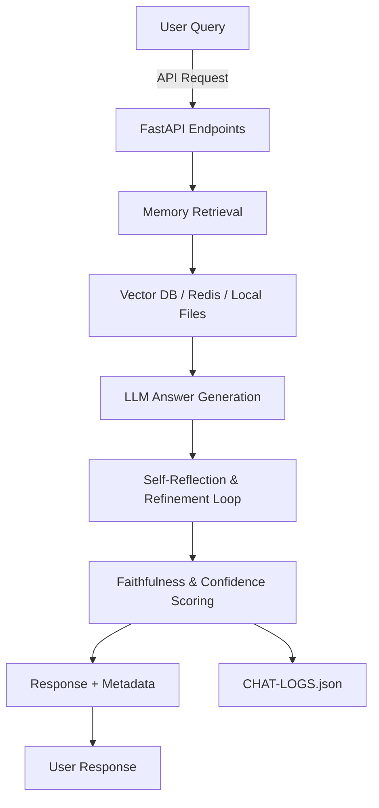
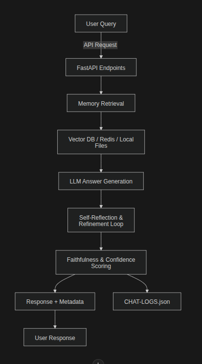
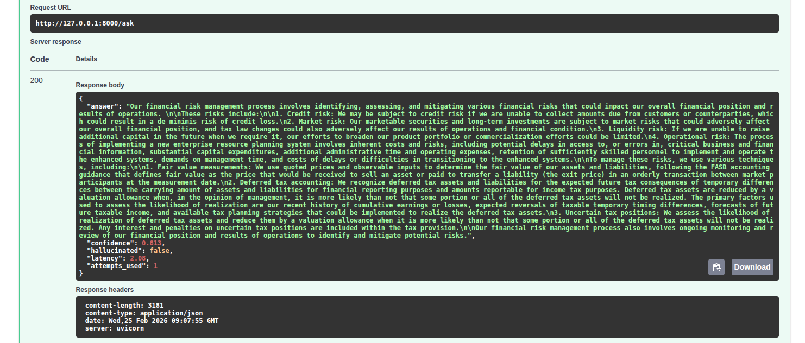
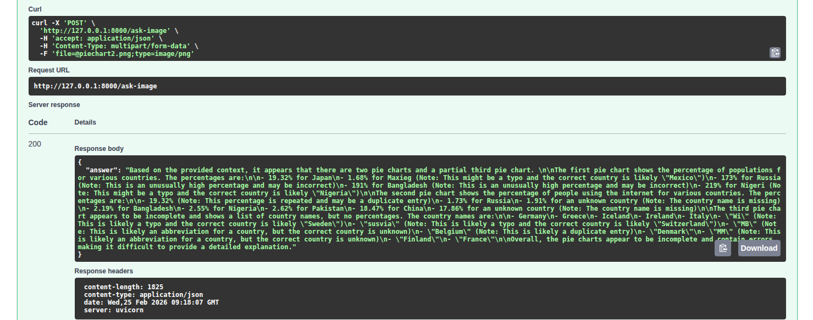
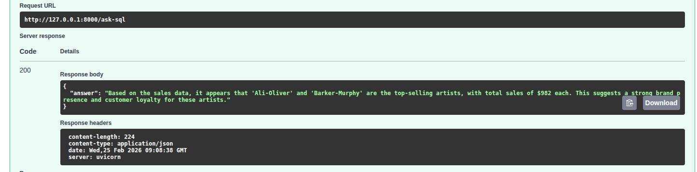
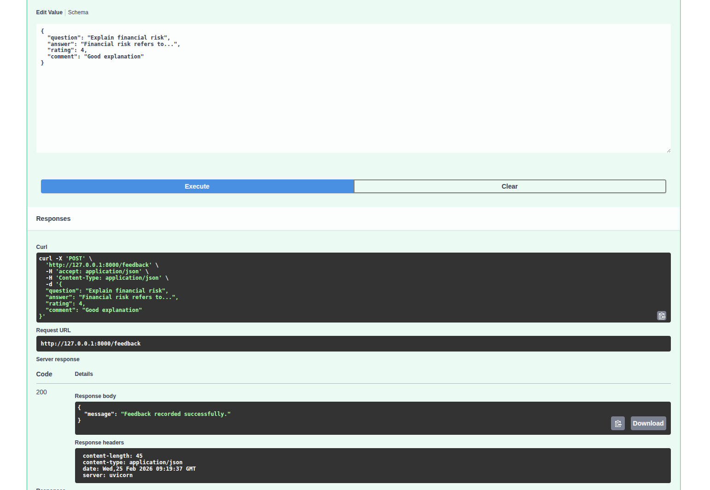
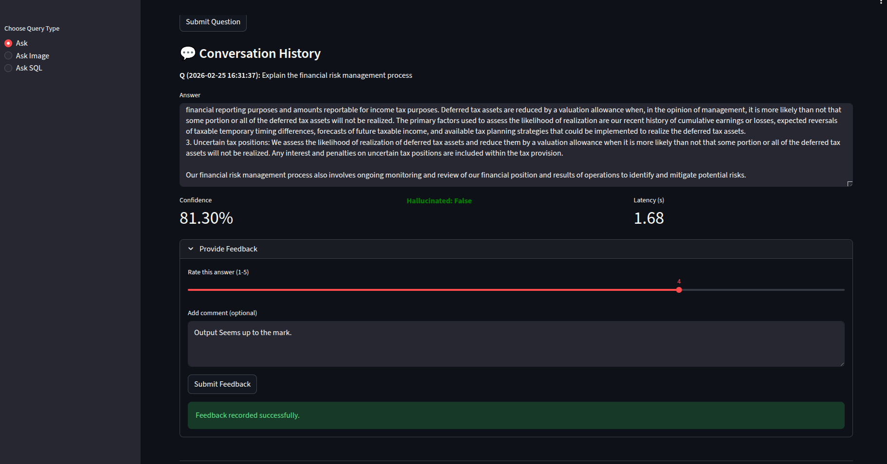
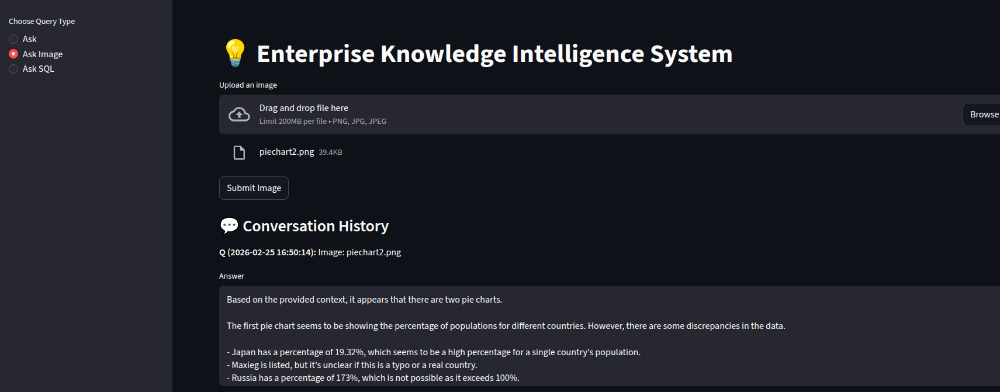
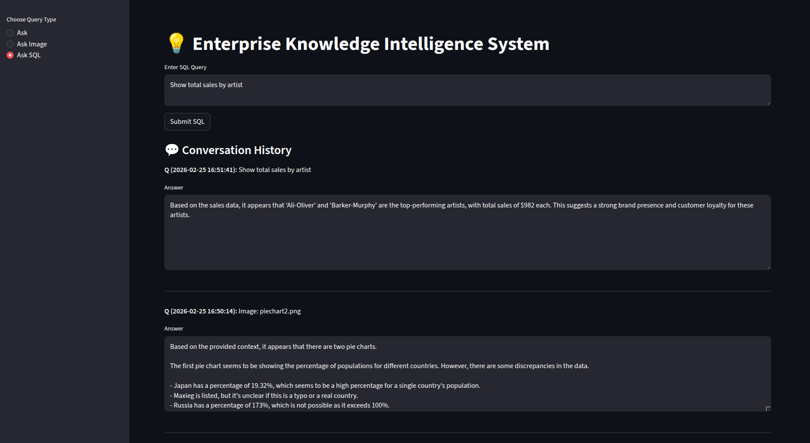

# DEPLOYMENT-NOTES.md

# DAY 5 — ADVANCED RAG + MEMORY + EVALUATION (CAPSTONE)

## Overview

This deliverable demonstrates a **Retrieval-Augmented Generation (RAG) + Memory system** built on Day-5, featuring:

- Conversational memory (last 5 messages)
- Self-reflection & refinement loops
- Hallucination detection & confidence scoring
- Production-ready FastAPI endpoints
- Logging of queries and responses

---

## Architecture





---

## Deployment & Setup

### 1️⃣ Clone Repository

```bash
git clone <your-repo-url>
cd <repo-root>
```

### 2️⃣ Create Virtual Environment & Activate

```bash
python3 -m venv .venv
source .venv/bin/activate   # Linux / Mac
# .venv\Scripts\activate    # Windows
```

### 3️⃣ Install Dependencies

```bash
pip install -r requirements.txt
```

### 4️⃣ Run FastAPI Backend

```bash
uvicorn deployment.app:app --reload --host 0.0.0.0 --port 8000
```

- Endpoints:
  - `http://127.0.0.1:8000/ask`
  - `http://127.0.0.1:8000/ask-image`
  - `http://127.0.0.1:8000/ask-sql`
  - `http://127.0.0.1:8000/feedback`
  - `/docs` → Swagger UI






### 5️⃣ Run Streamlit Frontend (Optional)

```bash
streamlit run deployment/streamlit_app.py
```

- Provides interactive UI for text, image, and SQL QA
- Maintains conversation history in session state
- Confidence/hallucinated/latency only for text queries





---

## Testing Commands

### 1️⃣ Test `/ask` Endpoint

```bash
curl -X POST "http://127.0.0.1:8000/ask" \
     -H "Content-Type: application/json" \
     -d '{"question": "What is the success rate of Kickstarter projects in 2023?"}'
```

### 2️⃣ Test `/ask-image` Endpoint

```bash
curl -X POST "http://127.0.0.1:8000/ask-image" \
     -F "file=@path_to_image/piechart.png"
```

### 3️⃣ Test `/ask-sql` Endpoint

```bash
curl -X POST "http://127.0.0.1:8000/ask-sql" \
     -H "Content-Type: application/json" \
     -d '{"question": "SELECT COUNT(*) FROM projects WHERE state=\'successful\';"}'
```

### 4️⃣ Test `/feedback` Endpoint

```bash
curl -X POST "http://127.0.0.1:8000/feedback" \
     -H "Content-Type: application/json" \
     -d '{"question":"What is AI?","answer":"Artificial Intelligence explanation","rating":5,"comment":"Very helpful"}'
```

---

## 🔹 Learning Points

- **RAG with LLM** allows context-aware answers from retrieved documents.
- **Memory integration** enables conversational flow across multiple queries.
- **Self-reflection loop** improves factual accuracy and removes hallucinations.
- **Confidence scoring** helps identify low-quality or hallucinated answers.
- **Streamlit integration** provides an interactive front-end for testing.
- **Logging** ensures all user interactions and evaluations are traceable.

---

## Notes / Tips

- Image queries may return `confidence=0.0` if extracted text is insufficient.
- Only text queries display `confidence`, `hallucinated`, and `latency` in Streamlit.
- Long answers should use `st.text_area` or `<br>` replacement for formatting.
- Session memory keeps last 5 messages; older history is truncated.
- Self-refinement loop is capped to prevent infinite LLM calls.
- API responses are logged in `CHAT-LOGS.json`.

---

## Example Flow Diagram (Mermaid)

```mermaid
graph TD
    User[User Query] -->|API Request| FastAPI[FastAPI Endpoints]
    FastAPI --> Memory[Memory Retrieval (Last 5 Messages)]
    Memory --> Context[Document Retrieval: Vector DB / Redis / Local Files]
    Context --> LLM[LLM Answer Generation]
    LLM --> Reflection[Self-Reflection & Refinement Loop]
    Reflection --> Confidence[Faithfulness & Confidence Scoring]
    Confidence --> Response[Return Answer + Metadata]
    Response --> User
    Confidence --> Logs[CHAT-LOGS.json / EVAL-LOGS.json]
```


