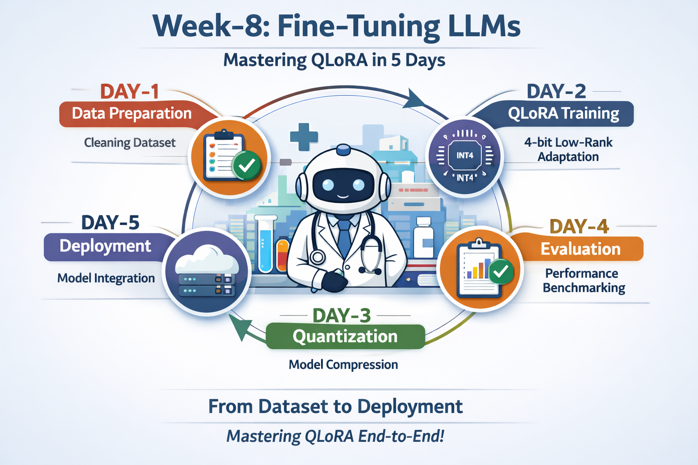

# WEEK-8 --- DAY-1

# DATASET ANALYSIS REPORT

------------------------------------------------------------------------

## 1️⃣ Objective

The goal of Day-1 was to prepare a clean, structured, and memory-safe
dataset suitable for parameter-efficient fine-tuning (QLoRA) of a Large
Language Model.

This step ensures stable training, prevents Out-of-Memory (OOM) errors,
and establishes a reproducible data pipeline.

------------------------------------------------------------------------

## 2️⃣ Dataset Overview

**Dataset Used:**\
medalpaca/medical_meadow_medical_flashcards

**Domain:** Healthcare / Medical Instruction

**Original Dataset Size:** 33,955

The dataset follows Alpaca-style instruction tuning format:

{ "instruction": "...", "input": "...", "output": "..." }

------------------------------------------------------------------------

## 3️⃣ Data Cleaning Steps Performed

### Removed Empty Samples

Entries missing `instruction` or `output` were discarded.

### Removed Duplicate Samples

Exact duplicate entries were removed using JSON hashing.

After deduplication: 33,527 samples

### Token Length Analysis

Token statistics before filtering:

-   Mean Token Length: 99.54\
-   Median Token Length: 66\
-   Minimum Token Length: 18\
-   Maximum Token Length: 387\
-   95th Percentile: 210

### Outlier Removal

Samples greater than 512 tokens were removed.

Since maximum token length was 387, no samples exceeded 512 tokens.

Final cleaned pool: 33,527 samples

------------------------------------------------------------------------

## 4️⃣ Final Dataset Construction

Selected subset: 1,200 high-quality samples

Split Strategy: 70 / 15 / 15

-   Train: 840\
-   Validation: 180\
-   Test: 180

------------------------------------------------------------------------

## 5️⃣ Why 512 Token Cap?

-   Prevents GPU memory overflow\
-   Ensures stable QLoRA training\
-   Keeps attention computation manageable\
-   Makes training safe for limited hardware (Colab)

------------------------------------------------------------------------

## 6️⃣ Engineering Decisions

  Decision                Rationale
  ----------------------- ---------------------------
  Public dataset          Avoid gated-access delays
  Remove duplicates       Prevent memorization bias
  512-token cap           OOM safety
  1200 sample selection   Efficient training size
  70/15/15 split          Reliable evaluation

------------------------------------------------------------------------

## 7️⃣ Key Learnings from Day-1

-   Clean data improves training stability\
-   Token length directly impacts memory usage\
-   Structured JSONL format is critical for instruction tuning\
-   Small, curated datasets work well for LoRA-based adaptation

------------------------------------------------------------------------

## 8️⃣ Conclusion

Day-1 successfully produced:

-   Cleaned instruction dataset\
-   Token-validated samples\
-   OOM-safe preprocessing\
-   Balanced train/val/test splits\
-   Reproducible data pipeline

The dataset is now fully prepared for QLoRA fine-tuning in Day-2.
