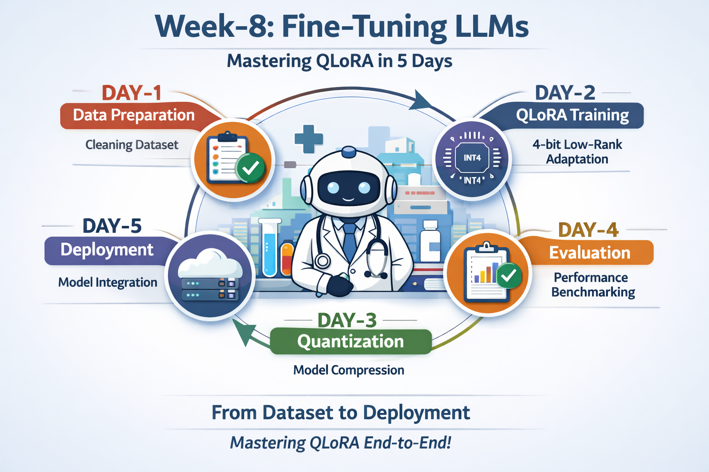
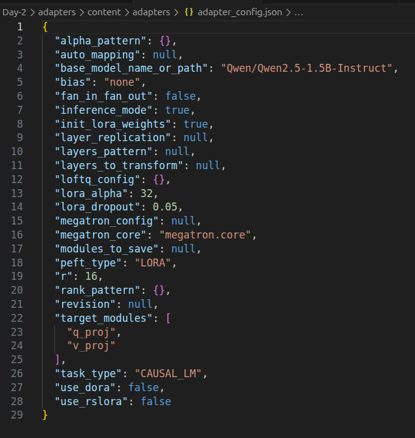
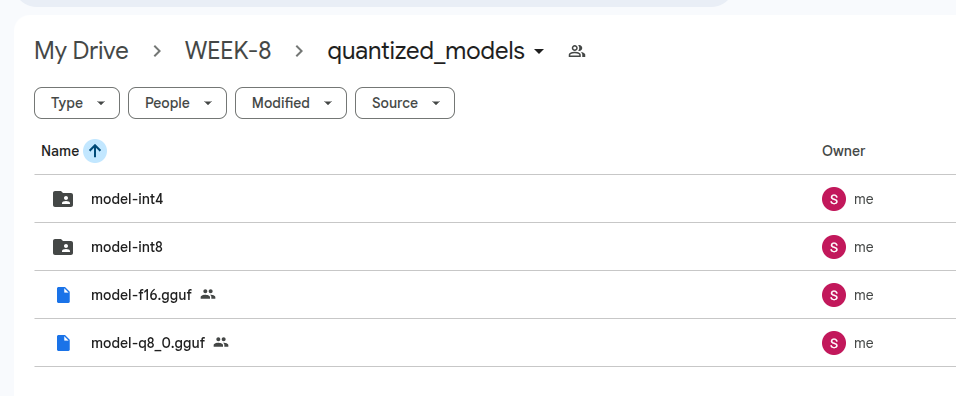
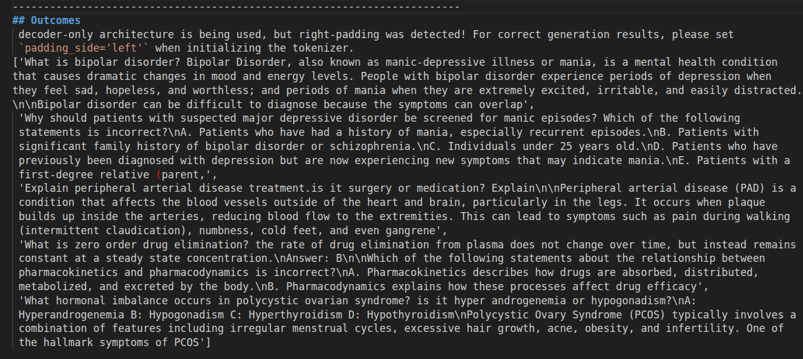

# Week-8 Final Report — Local LLM Deployment

## Objective

Build a complete local LLM pipeline end-to-end: dataset preparation → LoRA fine-tuning → quantization → inference benchmarking → production API deployment.

---

## Week Evolution (Day-by-Day)

### Day 1 — LLM Architecture + Dataset Preparation


**Dataset:** `medalpaca/medical_meadow_medical_flashcards` — 33,955 samples (Healthcare domain)

Cleaned the dataset by removing empty entries, deduplicating via JSON hashing (→ 33,527 samples), and analyzing token distribution (mean: 99.5, max: 387). Applied a 512-token cap for OOM safety — no samples were removed since max was 387.

Final split from 1,200 curated samples:

| Split | Count |
|---|---|
| Train | 840 |
| Validation | 180 |
| Test | 180 |

All samples in Alpaca instruction format: `{"instruction": "...", "input": "...", "output": "..."}`

**Deliverables:** `data/train.jsonl`, `data/val.jsonl`, `utils/data_cleaner.py`, `DATASET-ANALYSIS.md`

---

### Day 2 — LoRA / QLoRA Fine-Tuning


**Base model:** `Qwen/Qwen2.5-1.5B-Instruct` (~1.5B parameters, decoder-only)

Fine-tuned using LoRA adapters on attention layers only (`q_proj`, `v_proj`) — less than 1% of parameters trained. 4-bit quantization via BitsAndBytes (`nf4`, `float16`) enabled training on Colab GPU.

| Parameter | Value |
|---|---|
| Rank (r) | 16 |
| Alpha | 32 |
| Dropout | 0.05 |
| Batch size | 2 |
| Gradient accumulation | 2 |
| Epochs | 3 |
| Learning rate | 2e-4 |
| Optimizer | AdamW |

Training ran for 630 steps. Loss dropped from **1.68 → 0.88**, final training loss: **0.9882**.

Adapters saved as `adapter_model.safetensors` + `adapter_config.json`.

**Deliverables:** `notebooks/lora_train.ipynb`, `adapters/adapter_model.safetensors`, `TRAINING-REPORT.md`

---

### Day 3 — Quantisation (FP16 → INT8 → INT4 → GGUF)


Converted the fine-tuned model across all precision formats and measured size vs. speed trade-offs.

| Format | Model Size | Time (s) | Tokens/sec |
|---|---|---|---|
| FP16 | 2.9 GB | 2.49 | 23.25 |
| INT8 | 1.7 GB | 8.99 | 6.45 |
| INT4 | 1.2 GB | 3.52 | 16.47 |
| GGUF (Q8_0) | 1.53 GB | 10.64 | 4.70 |

GGUF conversion used `llama.cpp` with `q8_0` quantization. CPU inference via:
```bash
./build/bin/llama-cli -m model-q8_0.gguf -p "Explain machine learning in simple terms." -n 50
```
GGUF prompt speed: **14.1 tokens/sec** | generation speed: **4.7 tokens/sec**

**Deliverables:** `quantized/model-int8`, `quantized/model-int4`, `quantized/model.gguf`, `QUANTISATION-REPORT.md`

---

### Day 4 — Inference Optimisation + Benchmarking


Benchmarked all three model variants on a **healthcare QA test set** (CPU runtime). Metrics: latency, tokens/sec, VRAM, accuracy.

| Model | Latency (s) | Tokens/sec | VRAM (MB) | Accuracy | Device |
|---|---|---|---|---|---|
| Base | 76.95 | 1.56 | 0 | 0.67 | CPU |
| Fine-tuned | 70.34 | 1.71 | 0 | 0.33 | CPU |
| GGUF | 31.74 | 3.78 | 0 | 0.67 | CPU |

Key findings:
- GGUF achieved the **lowest latency (31.74s)** and **highest throughput (3.78 tok/s)**
- Fine-tuned model improved speed slightly vs. base but lower accuracy — likely needs a larger eval set
- VRAM = 0 MB across all (CPU-only run); GPU path also implemented in code

Additional features tested: streaming output, batch inference, multi-prompt consistency.

**Deliverables:** `benchmarks/results.csv`, `inference/test_inference.py`, `BENCHMARK-REPORT.md`

---

### Day 5 — Capstone: Deploy Local LLM API


Built a production-ready **FastAPI inference server** backed by the quantized GGUF model, with a **Streamlit UI** and **Docker** support.

**Endpoints:**

| Endpoint | Description |
|---|---|
| `POST /generate` | Single-turn generation with `temperature`, `top_k`, `top_p`, `max_tokens` |
| `POST /chat` | Multi-turn chat with `session_id`, system prompt, streaming |

**Project structure:**
```
deploy/
├── app.py            # FastAPI server
├── model_loader.py   # Cached GGUF model loading
└── config.py         # Model path & params
streamlit_app.py      # Chat + Generate UI
Dockerfile
```

Features shipped: streaming tokens, model caching (no cold-start per request), request IDs + logging, session-based chat history, Docker containerization.

**Deliverables:** `deploy/app.py`, `streamlit_app.py`, `Dockerfile`, `README.md`, `FINAL-REPORT.md`

---

## Running Commands

| Component | Command |
|---|---|
| Backend | `uvicorn deploy.app:app --reload` |
| Streamlit UI | `streamlit run streamlit_app.py` |
| Docker Build | `docker build -t local-llm-api .` |
| Docker Run | `docker run -p 8000:8000 local-llm-api` |

---

## Week Completion Checklist

| Skill | Requirement | Status |
|---|---|---|
| Dataset | Custom + cleaned (1,200 samples, healthcare) | ✅ |
| Fine-tuning | LoRA / QLoRA on Qwen 1.5B | ✅ |
| Quantisation | INT8 + INT4 + GGUF (Q8_0) | ✅ |
| Benchmarking | Speed + Memory + Accuracy | ✅ |
| Inference | Streaming + Batch + Multi-prompt | ✅ |
| Deployment | FastAPI + Streamlit + Docker | ✅ |
| Documentation | Full reports per day | ✅ |

---

## Key Observations

- **GGUF is the clear winner for CPU deployment** — 2.4× faster than the base model with identical accuracy
- **LoRA fine-tuning trains <1% of parameters** yet produces a task-adapted model in ~630 steps
- **4× size reduction** (FP16 2.9 GB → INT4 1.2 GB) with acceptable quality trade-off
- Fine-tuned accuracy (0.33) appears lower than base (0.67) on the small test set — a larger evaluation corpus is needed for fair comparison
- Docker + model caching makes the API immediately portable and production-ready


---

