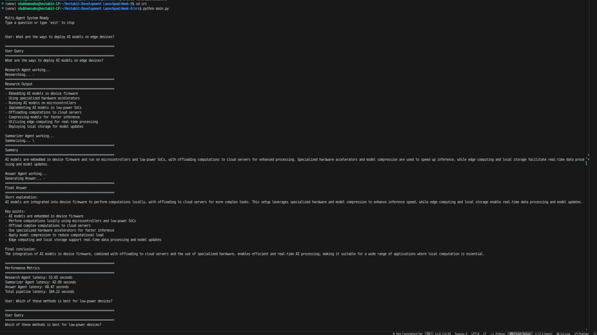

# Agent Fundamentals - Day 1

## Overview

Implementation of a multi-agent system using AutoGen with message-based
communication and role isolation.

Three agents collaborate in a sequential pipeline:

-   Research Agent
-   Summarizer Agent
-   Answer Agent

Each agent performs a single responsibility and passes its output to the
next agent.

------------------------------------------------------------------------
## Architecture
### Agent Pipeline
User Query → Research Agent → Summarizer Agent → Answer Agent → Final
Response

------------------------------------------------------------------------

## Core Concepts
### Perception → Reasoning → Action

Each agent performs:

1.  Perception -- receive input
2.  Reasoning -- process input based on role
3.  Action -- generate output

------------------------------------------------------------------------

### Role Isolation
  Agent              Responsibility
  ------------------ ---------------------------------
  Research Agent     Gather factual information
  Summarizer Agent   Condense research findings
  Answer Agent       Produce final structured answer

------------------------------------------------------------------------

## Model Configuration
  Parameter        Value
  ---------------- --------------------------
  Model            qwen2.5:7b-instruct-q4_0
  Memory Window    10
  Framework        Ollama

Memory is implemented using:

BufferedChatCompletionContext(buffer_size=10)

### Feature Engineering
The context window is not explicitly defined in the code. The system uses the model's default context window managed by Ollama. Since each agent maintains a limited memory buffer (`buffer_size=10`) and outputs are kept small (`num_predict=200`), the total prompt size remains well within safe limits.

**Possible Improvement:** The context window could be explicitly defined (e.g., `num_ctx=2048`) to provide better control over memory usage and potentially improve inference speed.

------------------------------------------------------------------------

# Screenshot
Add your terminal output screenshot here:

------------------------------------------------------------------------
------------------------------------------------------------------------

## Memory Architecture

Each agent keeps its own conversation history.

Query 1

Research Agent Memory\
\[Q1, Research_Output1\]

Summarizer Agent Memory\
\[Research_Output1, Summary1\]

Answer Agent Memory\
\[Summary1, FinalAnswer1\]

Query 2

Research Agent Memory\
\[Q1, Research_Output1, Q2, Research_Output2\]

Summarizer Agent Memory\
\[Research_Output1, Summary1, Research_Output2, Summary2\]

Answer Agent Memory\
\[Summary1, FinalAnswer1, Summary2, FinalAnswer2\]

Important:

-   Agents only remember their own messages
-   Memory is limited to the last 10 messages
