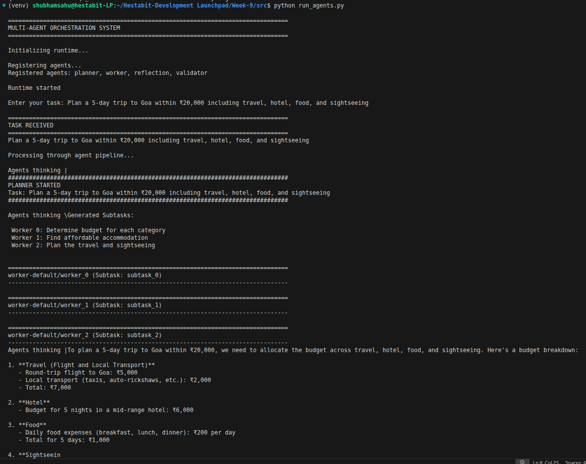
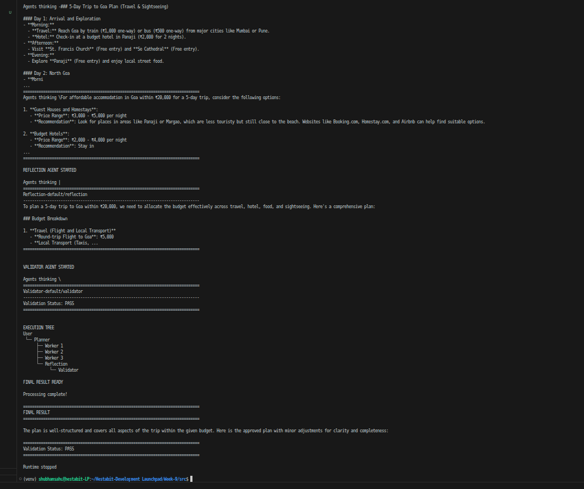

# Multi-Agent Orchestration System Flow Diagram

## Example User Query

**"Plan a 5-day trip to Goa within ₹20,000 including travel, hotel,
food, and sightseeing."**

------------------------------------------------------------------------

## Architecture Overview

    ┌─────────────────────────────────────────────────────────────────┐
    │                         USER QUERY                              │
    │   "Plan a 5-day trip to Goa within ₹20,000 including travel..." │
    └────────────────────────────┬────────────────────────────────────┘
                                 │
                                 ▼
    ┌─────────────────────────────────────────────────────────────────┐
    │                  AGENT RUNTIME LAYER                            │
    │             SingleThreadedAgentRuntime                          │
    │  - Manages agent lifecycle                                      │
    │  - Routes messages between agents                               │
    │  - Handles task execution                                       │
    └────────────────────────────┬────────────────────────────────────┘
                                 │
                                 ▼
    ┌─────────────────────────────────────────────────────────────────┐
    │                      PLANNER AGENT                              │
    │  - Receives UserTask                                            │
    │  - Breaks task into subtasks                                    │
    │  - Orchestrates workflow                                        │
    └────────────────────────────┬────────────────────────────────────┘
                                 │
                                 ▼
    ┌─────────────────────────────────────────────────────────────────┐
    │                    PHASE 1: PLANNING                            │
    │  - LLM analyzes query                                           │
    │  - Generates subtasks                                           │
    │  - Builds execution DAG                                         │
    │                                                                 │
    │ Example subtasks:                                               │
    │  1. Determine travel options within budget                      │
    │  2. Find affordable accommodation                               │
    │  3. Plan daily itinerary and food budget                        │
    └────────────────────────────┬────────────────────────────────────┘
                                 │
                                 ▼
    ┌─────────────────────────────────────────────────────────────────┐
    │              PHASE 2: PARALLEL WORKER EXECUTION                 │
    │                                                                 │
    │     ┌──────────────┐   ┌──────────────┐   ┌──────────────┐      │
    │     │  Worker 0    │   │  Worker 1    │   │  Worker 2    │      │
    │     │  (Travel)    │   │   (Hotel)    │   │ (Itinerary)  │      │
    │     │              │   │              │   │              │      │
    │     │ LLM finds    │   │ LLM finds    │   │ LLM plans    │      │
    │     │ budget       │   │ cheap stay   │   │ activities   │      │
    │     └──────┬───────┘   └──────┬───────┘   └──────┬───────┘      │
    │            │                  │                  │              │
    │            └──────────────────┴──────────────────┘              │
    │                             │                                   │
    │                 Output: WorkerResult[]                          │
    └────────────────────────────┬────────────────────────────────────┘
                                 │
                                 ▼
    ┌─────────────────────────────────────────────────────────────────┐
    │            PHASE 3: REFLECTION & SYNTHESIS                      │
    │                                                                 │
    │  Reflection Agent merges:                                      │
    │  - travel plan                                                  │
    │  - accommodation suggestions                                    │
    │  - sightseeing itinerary                                        │
    │                                                                 │
    │  Produces a single coherent trip plan.                          │
    └────────────────────────────┬────────────────────────────────────┘
                                 │
                                 ▼
    ┌─────────────────────────────────────────────────────────────────┐
    │               PHASE 4: VALIDATION & QA                          │
    │                                                                 │
    │  Validator Agent checks:                                        │
    │  - Budget correctness                                           │
    │  - Completeness of plan                                         │
    │  - Alignment with original task                                 │
    └────────────────────────────┬────────────────────────────────────┘
                                 │
                                 ▼
    ┌─────────────────────────────────────────────────────────────────┐
    │                      FINAL ANSWER                               │
    │   A complete Goa trip plan within ₹20,000 budget                │
    └─────────────────────────────────────────────────────────────────┘

------------------------------------------------------------------------

## DAG Execution Structure

    Layer 0 (Parallel)          Layer 1 (Serial)         Layer 2 (Serial)

      subtask_0
         (W0)     ┐
                    ├─────────────►  reflection  ────────►  validator
      subtask_1     │                   (R)                    (V)
         (W1)     ─┤
                    │
      subtask_2     │
         (W2)     ─┘

------------------------------------------------------------------------

## Agent Communication Flow

    User
     │
     ▼
    Planner Agent
     │
     ├── WorkerTask → Worker 0
     ├── WorkerTask → Worker 1
     └── WorkerTask → Worker 2
             │
             ▼
         Worker Results
             │
             ▼
         Reflection Agent
             │
             ▼
         Validator Agent
             │
             ▼
           Final Answer

------------------------------------------------------------------------
## Output Terminal

## Execution Timeline

    T0 — User submits Goa trip query
    T1 — Planner receives UserTask
    T2 — LLM generates subtasks
    T3 — Workers dispatched
    T4 — Workers generate results
    T5 — Reflection agent synthesizes plan
    T6 — Validator checks quality
    T7 — FinalAnswer returned
