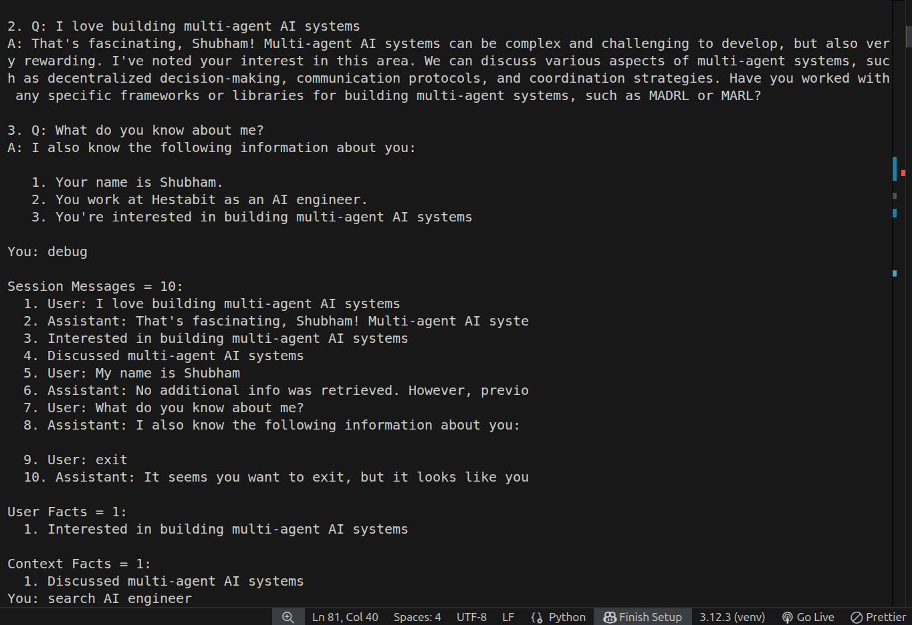

# MEMORY-SYSTEM.md — Day 4: Memory Systems

---

## Objective

Build an agent that remembers conversations across sessions using three types of memory — short-term, long-term, and vector-based similarity search.

---

## Architecture

```
User Input
    |
    v
Vector Search (FAISS)
    |
    v
Inject relevant memories into prompt
    |
    v
Agent generates response
    |
    v
+-----------+-----------+-----------+
|           |           |           |
Session    Vector     LongTerm
Memory     Memory      Memory
(turns)  (FAISS embed) (SQLite)
    |
    v
Fact Extractor
    |
    v
User Facts → SQLite (semantic, importance=9)
Context Facts → SQLite (episodic, importance=5)
```

---

## Memory Types

| Type | File | Stores | Persists? |
|------|------|--------|-----------|
| Session | `session_memory.py` | Last 10 conversation turns in-memory |  lost on restart |
| Long-term | `longterm_memory.py` | User facts + context in SQLite | survives restart |
| Vector | `vector_memory.py` | FAISS embeddings for similarity search |  survives restart |

---

## Files

| File | Role |
|------|------|
| `main_day4.py` | Entry point + CLI commands |
| `memory_agent.py` | Search → Inject → Generate → Store → Extract |
| `unified_memory.py` | Combines all 3 memory stores |
| `fact_extractor.py` | Extracts user facts and context from conversation |
| `session_memory.py` | Short-term in-memory store |
| `longterm_memory.py` | SQLite persistent store |
| `vector_memory.py` | FAISS vector store |

---

##output


---
## Flow

```
New Query
    |
    v
1. Search vector store for similar past memories
    |
    v
2. Inject top 2 matches into prompt as context
    |
    v
3. Agent generates response using context
    |
    v
4. Store Q+A in session memory (short-term)
   Store Q+A in vector store (FAISS)
    |
    v
5. Fact extractor pulls:
   - [USER] facts → SQLite as semantic (importance=9)
   - [CONTEXT] facts → SQLite as episodic (importance=5)
```

---

## Example

**Input:** `My name is Shubham and I work at Hestabit as an AI engineer`

**What gets stored:**
```
Session   → "User: My name is Shubham..."
           "Assistant: Nice to meet you..."
Vector    → embedding of full Q+A pair
LongTerm  → no facts (first message, model missed extraction)
```

**Input:** `I love building multi-agent AI systems`

**What gets stored:**
```
Session   → adds 2 more turns
Vector    → embedding of Q+A pair
LongTerm  → [USER] Interested in building multi-agent AI systems (importance=9)
           [CONTEXT] Discussed multi-agent AI systems (importance=5)
```

---

## Commands

```bash
cd Week-9/src/memory
python main_day4.py
```

| Command | What it does |
|---------|-------------|
| Any message | Search → Inject → Generate → Store → Extract |
| `debug` | Shows session turns, user facts, context facts |
| `search <query>` | FAISS similarity search with scores |
| `clear` | Wipes all 3 memory stores |
| `quit` | Saves and exits |

---

## Persistence Test

```
# Session 1
You: My name is Shubham and I love AI
You: quit

# Session 2 — restart
python main_day4.py
→ Loaded: 1 facts, 1 embeddings   ← SQLite + FAISS survived
You: Do you remember me?
→ Agent recalls Shubham from longterm memory
```

---

## Deliverables

- `memory/session_memory.py`
- `memory/longterm_memory.py`
- `memory/vector_memory.py`
- `memory/unified_memory.py`
- `memory/fact_extractor.py`
- `memory/memory_agent.py`
- `memory/main_day4.py`
- `memory/db/long_term.db` ← auto-created
- `memory/db/vector_store.faiss` ← auto-created
- `MEMORY-SYSTEM.md`
